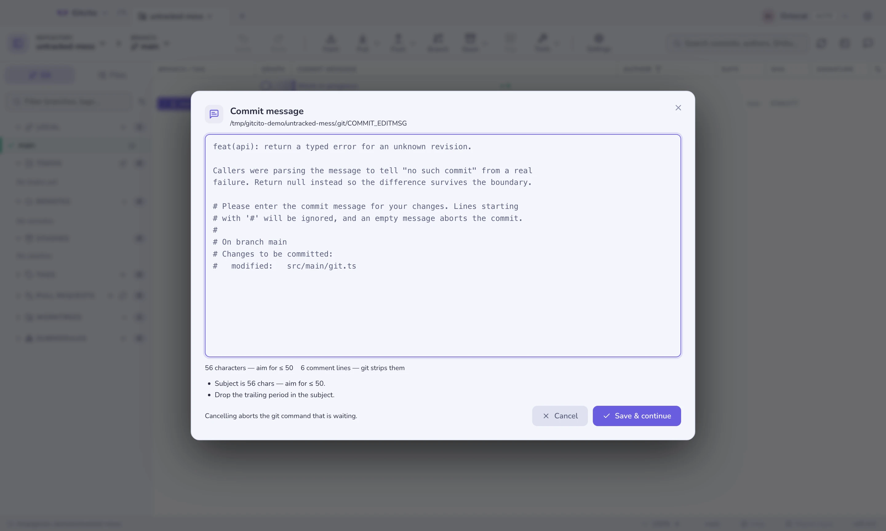

# Wiersz poleceń

Z terminala zadaje się dwa rodzaje pytań, a `gitcito` odpowiada na oba.

Pierwsze to *„pokaż mi to”* — jesteś w klonie, coś trzeba obejrzeć, a aplikacja
jest właściwym miejscem, żeby to zrobić. Takie wywołania otwierają okno, jak
najbliżej tego, o co pytałeś.

Drugie to *„powiedz mi teraz”* — hook, zadanie CI albo ty sam w środku potoku,
chcący odpowiedzi i kodu wyjścia zamiast okna. Te nigdy nie uruchamiają
aplikacji: piszą na stdout i schodzą z drogi.

```sh
gitcito .                        # otwórz ten katalog
gitcito blame src/api.ts -l 84   # …na blame tego wiersza
gitcito doctor                   # bez okna: sprawdza repo, kończy się 1 przy błędzie
```

## Instalacja

Paleta poleceń (<kbd>⌘K</kbd>) → **Zainstaluj polecenie 'gitcito' w PATH**. Na
macOS tworzy dowiązanie symboliczne do małego shima w `/usr/local/bin` lub
`/opt/homebrew/bin` i prosi o uprawnienia administratora tylko wtedy, gdy żaden z
nich nie jest dla ciebie zapisywalny. Na Linuksie trafia do `~/.local/bin`, gdzie
nie trzeba żadnych uprawnień. To samo polecenie odinstalowuje. Windows nie jest
jeszcze wspierany.

Następnie, opcjonalnie:

```sh
gitcito completions zsh >> ~/.zshrc     # albo bash, albo fish
```

## Otwieranie

| Polecenie | Otwiera |
|-----------|---------|
| `gitcito [ścieżka]` | Repozytorium (domyślnie: bieżący katalog) |
| `gitcito open <nazwa>` | Repozytorium po **nazwie karty** — `gitcito open api` |
| `gitcito diff` | Niezatwierdzone zmiany |
| `gitcito graph` | Graf commitów |
| `gitcito show <ref>` | Jeden commit — `HEAD~2`, tag, krótki hash |
| `gitcito blame <plik>` | Blame pliku; z `-l 84` wprost na wiersz |
| `gitcito search <zapytanie>` | Wyszukiwanie w kodzie z wpisanym zapytaniem |
| `gitcito stack`, `stash`, `reflog`, `conflicts`, `todos`, `chat`, `settings` | Ten panel |
| `gitcito ci`, `clean`, `bisect`, `absorb`, `snapshots`, `insights`, `terminal` | …i tak dalej |

`gitcito help verbs` wypisuje pełną listę. Trzy opcje działają dla wszystkich:
`-n <nazwa>` ustawia wyświetlaną nazwę karty, `-g <grupa>` umieszcza je w karcie
grupy (tworząc ją w razie potrzeby), a `-l <n>` wybiera wiersz.

Gitcito działa w **pojedynczej instancji**: uruchomienie `gitcito` przy otwartej
aplikacji przekazuje żądanie temu oknu, zamiast startować drugą kopię. Ścieżka
już otwarta — jako karta albo wewnątrz grupy — dostaje **fokus**, a nie duplikat.
Katalog, który nie jest jeszcze repozytorium, i tak się otworzy, proponując
„zainicjuj tutaj repozytorium”.

## Odpowiedź w terminalu

Te polecenia wypisują wynik i kończą pracę. Żadne okno się nie otwiera, a
aplikacja nie musi nawet działać.

### `gitcito status`

Gałąź, śledzenie, przed/za, katalog roboczy, schowki oraz — jeśli repozytorium ją
dostarcza — [listę kontrolną przed pushem z `.gitcito.json`](repo-config.md).
Kończy się kodem 1, gdy w katalogu roboczym są konflikty, więc
`gitcito status || echo zablokowane` działa.

### `gitcito doctor [--fix]`

Wykonuje te same kontrole co panel [konfiguracji repozytorium](repo-config.md):
wersję Node, submoduły, LFS, `core.hooksPath`, wymagane pliki. **Kończy się
kodem 1, jeśli któraś zawiedzie** — i o to chodzi: reguły, które repozytorium
deklaruje, niewiele znaczą, jeśli widzi je tylko osoba z otwartym interfejsem:

```yaml
- run: gitcito doctor          # w CI, przed czymkolwiek kosztownym
```

`--fix` stosuje naprawy, które doktor zna (inicjalizacja submodułów, `lfs pull`,
ustawienie `core.hooksPath`, skopiowanie pliku z jego przykładu) i sprawdza
ponownie. Nigdy nie uruchamia polecenia dostarczonego przez konfigurację — zbiór
napraw jest zamknięty.

Ostrzeżenia nie powodują niepowodzenia. Ostrzeżenie znaczy, że doktor czegoś nie
zdołał ustalić, a nie że coś jest źle; przerywanie na tym builda uczyniłoby ten
plik zbyt kosztownym w przyjęciu.

### `gitcito commit-check [plik]`

Sprawdza opis commita. Bez argumentu czyta `.git/COMMIT_EDITMSG`; `-m "…"`
sprawdza podany tekst. Wie, co zadeklarowało repozytorium: nieznany zakres jest
**błędem**, gdy `.gitcito.json` wymienia zakresy, a jedynie poradą stylistyczną,
gdy ich nie wymienia. Podepnij do hooka:

```sh
# .husky/commit-msg
gitcito commit-check "$1"
```

### `gitcito config init | show | check`

`init` czyta repozytorium i proponuje `.gitcito.json` na podstawie tego, co już
jest — `.nvmrc`, `.gitmodules`, `.env.example` bez `.env`, zakresy commitów
używane w historii. `--dry-run` wypisuje zamiast zapisywać. `show` drukuje
bieżący plik; `check` waliduje go i wypisuje każde pole, które zostałoby
odrzucone.

### `gitcito repos [filtr]`

Każde repozytorium, które Gitcito zna — najpierw otwarte karty, potem ostatnio
używane — wraz z grupą. `--paths` wypisuje same ścieżki, po jednej w wierszu, do
skryptów:

```sh
cd "$(gitcito repos --paths api | head -1)"
```

## Gitcito jako edytor gita

```sh
gitcito editor install
```

ustawia `core.editor` i `sequence.editor` na `gitcito --wait`. Od tej chwili
`git commit` (bez `-m`), `git commit --amend`, `git tag -a` i `git rebase -i`
otwierają swój plik w Gitcito zamiast w vimie, z licznikiem znaków i tymi samymi
podpowiedziami do opisu, które pokazuje kompozytor.



Kluczowe jest słowo **czeka**: git jest zablokowany na tym oknie. Zatem

- **Zapisz i kontynuuj** zapisuje plik z powrotem, a git idzie dalej.
- **Anuluj** zapisuje pusty plik, co git czyta jako *przerwij*.
- Zamknięcie okna w jakikolwiek inny sposób — Escape, tło, wyjście z Gitcito —
  liczy się jako Anuluj. Terminal czekający w nieskończoność byłby o wiele
  gorszy niż opis do przepisania.

Dodaj `--local`, aby ograniczyć to do jednego repozytorium, i cofnij przez
`gitcito editor uninstall`.

## Czego nie zrobi

- **Żaden czasownik terminalowy nie modyfikuje repozytorium.** `doctor --fix` to
  jedyny wyjątek, a jego naprawy są stałą listą, której plik konfiguracyjny nie
  może rozszerzyć.
- **`repos` tylko czyta.** Działająca aplikacja jest właścicielem swojego pliku
  ustawień; CLI go czyta i nigdy nie zapisuje.
- **Czasownik, którego zainstalowana aplikacja nie zna, jest ignorowany**, a nie
  odrzucany — nowszy shim przy starszej aplikacji i tak otworzy repozytorium.
- **Windows nie ma jeszcze shima.** Wszystkie czasowniki są zaimplementowane;
  brakuje tylko ścieżki instalacji.

**Zobacz też:** [Obszary robocze, karty i grupy](workspaces.md) ·
[Konfiguracja repozytorium](repo-config.md) · [Commitowanie](committing.md)
