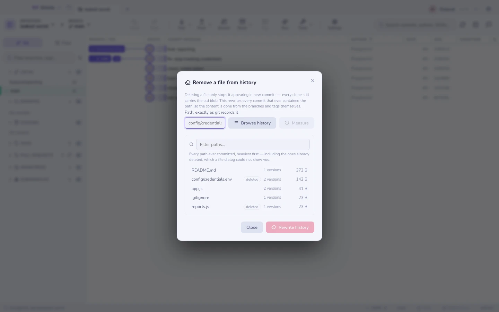
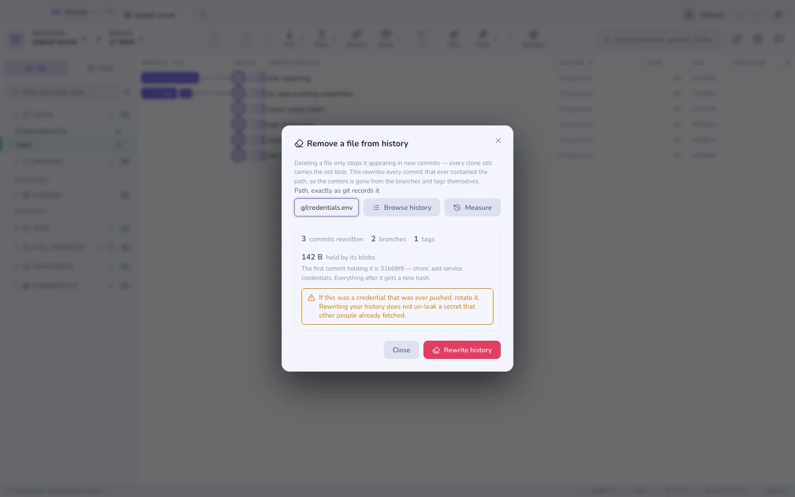

# Usuwanie pliku z historii

`git rm` powstrzymuje plik przed pojawianiem się w *nowych* commitach. Z tymi
już zrobionymi nie robi nic: blob dalej jest w bazie obiektów, dalej jest
w każdym klonie, dalej jest o jedno `git show` od ciebie.

Ma to znaczenie w dwóch przypadkach — kiedy plik był poświadczeniem i kiedy
miał 400 MB.

`⌘K` → **Usuń plik z historii** albo kliknij plik prawym przyciskiem — w drzewie
projektu, na liście plików commita albo w kompozytorze commita. To właśnie przy
commicie, który *usunął* plik, ktoś zwykle uświadamia sobie, że plik wciąż jest
w historii — więc wyjście też jest w tamtym menu.

## Znalezienie ścieżki

Dwie drogi wejścia, bo odpowiadają na różne pytania.

**Wpisz ją** — względem repozytorium, bez wiodącego ukośnika — kiedy już wiesz,
co przyszedłeś usunąć.

**Przejrzyj historię**, kiedy nie wiesz. Wypisuje każdą ścieżkę, jaka
kiedykolwiek została zacommitowana, od najcięższej, z liczbą wersji każdej z nich
i informacją, czy wciąż jest śledzona. Ścieżki usunięte są oznaczone jako takie
i zwykle to o nie chodzi: plik, którego nie ma w drzewie roboczym, ale wciąż
jest w każdym klonie, to dokładnie ten przypadek, którego zwykłe okno wyboru
pliku nie pokaże — bo tego pliku po prostu nie ma do wybrania.

Ta sama lista odpowiada na drugi powód, dla którego ludzie tu trafiają — *czemu
ten klon ma dwa gigabajty* — bo jest posortowana według bajtów, które faktycznie
zajmują bloby każdej ścieżki. Wybranie wiersza mierzy ją od razu.



## Zmierz, zanim się zgodzisz

Naciśnij **Zmierz** (albo wybierz wiersz). Nic jeszcze nie jest zapisywane.
Dostajesz:

| | |
|---|---|
| **Przepisane commity** | Każdy commit od pierwszego, który zawierał ten plik, w górę |
| **Gałęzie / tagi** | Referencje, które się przesuną |
| **Zajmowane przez jego bloby** | Bajty, które te wersje faktycznie zajmują |
| **Pierwszy commit** | Miejsce, w którym zaczyna się przepisanie — wszystko po nim dostaje nowy hash |



Jeśli licznik pokazuje zero, ścieżka jest zła. To zwykle literówka albo prefiks
katalogu, a nie brak pliku.

## Co przepisanie faktycznie robi

Gitcito kopiuje każdą gałąź i tag do
`refs/gitcito/pre-purge/<timestamp>/…`, a potem uruchamia:

```sh
git filter-branch --force \
  --index-filter 'git rm --cached --ignore-unmatch -- <path>' \
  --prune-empty --tag-name-filter cat -- --branches --tags
```

`--index-filter` przepisuje indeks bezpośrednio, zamiast wypakowywać każdy
commit — to różnica między minutami a godzinami. `--branches --tags` zamiast
`--all` jest celowe: `--all` obejmowałoby referencje kopii zapasowej,
a przepisanie zjadłoby własną siatkę bezpieczeństwa.

Commity, które nie zawierały nic poza usuniętym plikiem, są porzucane
(`--prune-empty`). Tagi są przestawiane na swoje przepisane commity.

## Kopia zapasowa i dlaczego miejsce jeszcze nie wraca

Czystkę da się cofnąć, a ceną za to jest to, że **miejsce na dysku nie zostaje
odzyskane, dopóki tego nie powiesz**. Dopóki kopia zapasowa istnieje, stare
commity są nadal osiągalne, więc git ich nie zbierze.

| Akcja | Efekt |
|--------|--------|
| **Przywróć** | Każda gałąź i tag wracają do swojego commita sprzed czystki; plik wraca razem z nimi |
| **Porzuć kopię zapasową** | Kasuje referencje kopii, wygasza reflog, uruchamia `git gc --prune=now` — miejsce wraca, czystka staje się nieodwracalna |

Dwa kroki, a nie jeden, bo pierwszy jest tą odzyskiwalną połową, a drugi nie.

## I tak zrotuj sekret

**Jeśli poświadczenie kiedykolwiek zostało wypchnięte, przepisanie twojej
historii nie cofa wycieku.** Ktoś mógł je pobrać; serwery hostingowe trzymają
niereferowane obiekty w pobliżu; log CI mógł je wypisać. Przepisanie
powstrzymuje jego dalsze rozchodzenie się — nie cofa ekspozycji.

Zrotuj klucz. Potem zrób czystkę, żeby następna osoba klonująca go nie
znalazła.

## Czego nie zrobi

- **Nie zrobi pusha.** Przepisanie jest lokalne. Opublikowanie wyniku oznacza
  force push na każdą dotkniętą gałąź, a wszyscy inni muszą sklonować od nowa
  albo zrobić hard reset — decyzja o tym mieszka
  [w zabezpieczeniu force pusha](syncing.md).
- **Odmawia przy brudnym drzewie roboczym** albo w środku merge'a/rebase'a.
  Przepisanie wielokrotnie przesuwa HEAD, a robienie tego wokół
  niezacommitowanej pracy to sposób, w jaki się ją gubi.
- **Przepisuje po ścieżce, nie po treści.** Usunięcie sekretu, który został
  wklejony do pliku źródłowego, zamiast mieszkać we własnym pliku, wymaga filtra
  treści — to terytorium `git filter-repo --replace-text`, którego Gitcito nie
  opakowuje.
- **`filter-branch` jest wolny na bardzo dużych historiach.** Jest tym, co
  wszędzie przychodzi razem z gitem, i dlatego właśnie jest tym, czego Gitcito
  używa. Na repozytorium z dziesiątkami tysięcy commitów szybszym narzędziem
  jest `git filter-repo` w [terminalu](terminal.md).
- **Klony innych ludzi to nie twoje repozytorium.** Zachowają starą historię,
  dopóki nie sklonują od nowa.
