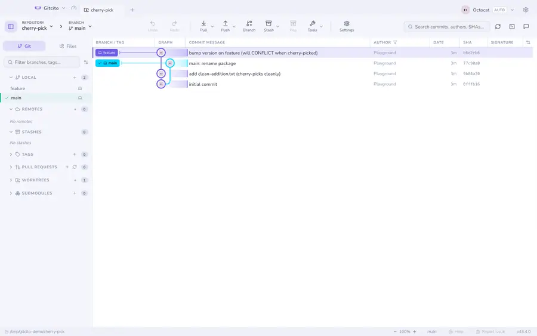

# Notatki do commitów

Wiadomość commita pisze się raz, a potem zamarza: jej zmiana przepisuje commit,
nadaje mu nowy hash i psuje sytuację wszystkim, którzy mają już starą wersję. To
w porządku godzinę po commicie i niemożliwe tydzień później.

`git notes` jest wyjściem z tego. Notatka jest przechowywana **obok** commita,
pod `refs/notes/commits`, a jej dopisanie zostawia commit identycznym bajt po
bajcie. Działa więc na historii, która jest już opublikowana — czyli dokładnie
wtedy, kiedy najbardziej chcesz coś dopisać.

Typowe zastosowanie: recenzja, która go zatwierdziła, zgłoszenie, które zamknął,
powód, dla którego został wycofany, wydanie, w którym pojechał.

## Pisanie notatki

Zaznacz commit. Pod wiadomością jest sekcja **Notatka**: *Dodaj notatkę*, pisz,
**Zapisz notatkę**. Wiele linii jest w porządku.



Zapisanie notatki to zwykła akcja Gitcito — pokazuje toast, a **Cofnij**
przywraca poprzedni tekst, łącznie z odtworzeniem notatki, którą usunąłeś.

Wyczyszczenie tekstu i zapisanie usuwa notatkę; coś takiego jak pusta notatka
nie istnieje.

## Znajdowanie notatki

Notatki są niewidoczne w zwykłym logu, co jest głównym powodem, dla którego
nikt ich nigdy nie odkrywa. Gitcito oznacza commit, który jakąś niesie, małą
ikoną notatki w kolumnie wiadomości w grafie — adnotacja jest więc do
znalezienia bez wiedzy, że tam w ogóle jest.

Z wiersza poleceń `git log --notes` wypisuje je pod każdą wiadomością.

## Dzielenie się nimi

**To jest ta część, która zaskakuje wszystkich: zwykły `git push` nie wypycha
notatek, a zwykły `git fetch` ich nie pobiera.** Żyją poza `refs/heads`
i `refs/tags`, więc domyślne refspecki całkowicie je pomijają. Notatki napisane
na twoim laptopie zostają na twoim laptopie, dopóki ktoś ich jawnie nie
przeniesie.

Narzędzia → **Notatka** → *Wypchnij notatki* / *Pobierz notatki*, dla każdego
zdalnego repozytorium z osobna. Uruchamiają:

```sh
git push <remote> refs/notes/*
git fetch <remote> +refs/notes/*:refs/notes/*
```

Niektóre hostingi wymagają jeszcze włączenia albo dopuszczenia notatek po swojej
stronie; odmowa stamtąd to polityka hostingu, a nie ograniczenie Gitcito.

## Ograniczenia

- **Jedna referencja notatek.** Gitcito czyta i zapisuje domyślne
  `refs/notes/commits`. Własne przestrzenie nazw (`git notes --ref=review`) nie
  są wystawione — repozytorium, które ich używa, nie zobaczy tutaj tamtych
  notatek.
- **Brak scalania rozbieżnych notatek.** Jeśli dwie osoby opiszą ten sam commit
  i obie zrobią push, git odrzuci drugi push. Rozwiązanie tego oznacza
  `git notes merge` w [terminalu](terminal.md).
- **Notatki nie są objęte kopią zapasową czystki historii** ani
  [migawkami](recovery.md). To zwykłe referencje i przeżywają normalne
  operacje, ale repozytorium sklonowane od zera startuje bez nich.

Zobacz też: [Commitowanie](committing.md) · [Graf commitów](graph.md)
