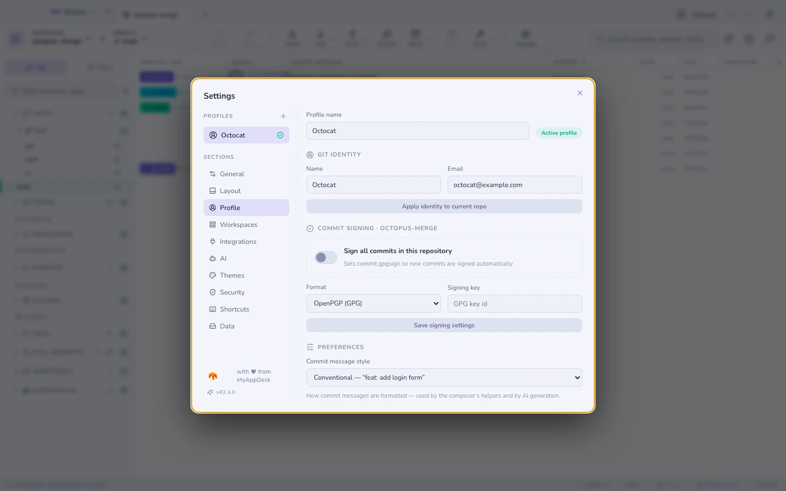

# Profile

Profil wiąże **tożsamość Gita** (imię i adres e-mail) z jej **tokenami
integracji**. Przełącz profil, a zmieniają się oba naraz — commity są
podpisywane właściwym autorem, a wywołania API korzystają z właściwego konta.

Przydatne, gdy ta sama maszyna obsługuje repozytoria służbowe i prywatne albo
gdy masz dwa konta GitHub.

## Powiązanie z repozytorium

Repozytorium da się **przypiąć do profilu**, dzięki czemu fetch w tle zawsze
uwierzytelnia się na właściwym koncie — nawet gdy właśnie patrzysz na
repozytorium należące do tego drugiego.

Tokeny mieszkają w twoim [pęku kluczy systemu](security.md), nigdy w pliku
ustawień.

**Zobacz też:** [Bezpieczeństwo i sekrety](security.md) · [Hosting](hosting.md)
