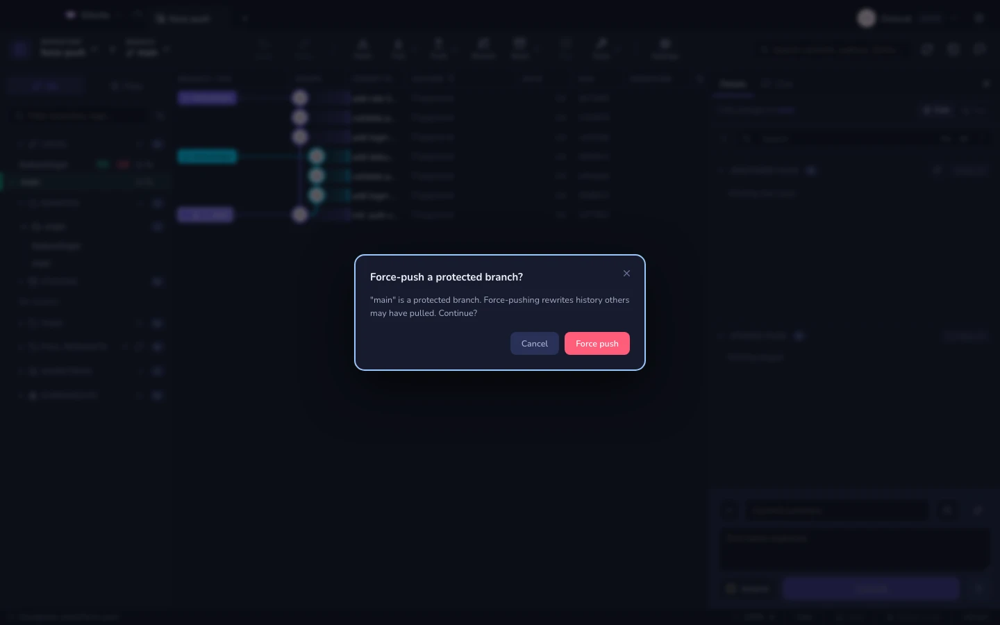

# Fetch, pull i push

## Pull

Trzy tryby, wybierane z listy: **domyślny**, **tylko fast-forward** albo
**rebase**. Lokalne zmiany są automatycznie chowane do stasha i przywracane
wokół pulla, więc brudne drzewo cię nie blokuje.

### Gałąź, która niczego nie śledzi

`git pull` to fetch, a po nim merge — i ten merge musi wiedzieć, *do czego*
scalać: do upstreamu gałęzi. Gałąź utworzona lokalnie albo pobrana bez śledzenia
nie ma go wcale. Fetch i tak się udaje, przewija się długa lista zaktualizowanych
refów `origin/*`, a potem git staje z *"There is no tracking information for the
current branch"*. Nic nie zostało pobrane i nic się nie zepsuło: druga połowa po
prostu nie miała celu.

Gitcito czyta ten błąd i podaje naprawę jako przycisk, wybierając którą — zależnie
od tego, czy remote ma już tę gałąź:

| | |
|---|---|
| **Jest na remote** | **Połącz i zrób pull** — ustawia upstream na `<remote>/<gałąź>`, a potem robi pull, o który prosiłeś. **Cofalne przez ⌘Z**, co znów zdejmuje śledzenie. |
| **Jeszcze jej tam nie ma** | **Wypchnij gałąź** — zwykły push, który przy okazji ustawia upstream. |

Proponowany remote to `origin`, jeśli istnieje, w przeciwnym razie pierwszy z
listy. To, w którym przypadku jesteś, odczytywane jest z refów śledzących, a nie
z sieci — odpowiedź odzwierciedla więc fetch, który właśnie przebiegł.

## Push

Force push zawsze używa `--force-with-lease` — bezpiecznego wariantu, który
odmawia, jeśli zdalne repozytorium ruszyło się od czasu, gdy ostatnio
patrzyłeś. Push z force'em na **chronioną gałąź** prosi o potwierdzenie (listę
znajdziesz w kole zębatym ustawień repozytorium).

### Więcej niż jedno zdalne repozytorium

Przycisk **Push** celuje w upstream gałęzi. Strzałka obok niego, gdy tylko
repozytorium ma więcej niż jedno zdalne, oferuje dodatkowo:

| | |
|---|---|
| **Push do jednego zdalnego** | Wybierz jedno — fork, mirror, cel wdrożenia |
| **Push do wszystkich N zdalnych** | Jeden push na zdalne, po kolei |
| **Wypchnij wszystkie tagi do** | `git push <remote> --tags`, każdy lokalny tag naraz |

Te same dwie akcje siedzą na wierszu każdego zdalnego w panelu bocznym — a to
zwykle miejsce, w którym jesteś, gdy pytanie się pojawia.

**Odmowa nie anuluje reszty.** Push do forka i do jego upstreamu to dokładnie
ten przypadek, w którym jedna strona odmawia, a druga i tak powinna przejść —
więc każde zdalne raportuje osobno: sukcesy są wymienione w jednym toaście,
a każda porażka dostaje własny, z powodem podanym przez gita.

Upstream gałęzi ustawia wyłącznie **pierwsze** zdalne z listy. Gałąź ma jeden
upstream, a ostatnie zdalne, do którego zrobiłeś push, nie jest automatycznie
tym, które ma być śledzone.

Obie drogi wykonują te same sprawdzenia co zwykły push — potwierdzenie chronionej
gałęzi i [zabezpieczenie przed sekretami](security.md). Publikowanie do dwóch
zdalnych to podwójna ekspozycja, a nie połowa ostrożności.

## Gałęzie, na których nie jesteś

`git pull` przesuwa tylko HEAD — dlatego większość klientów każe najpierw
przełączyć się na gałąź, żeby ją zaktualizować. Gitcito nie: kliknij prawym
przyciskiem dowolną gałąź lokalną — na pasku bocznym albo na jej etykiecie w
[grafie](graph.md) — i dostaniesz **Pobierz \<gałąź\>** oraz **Wypchnij
\<gałąź\>**, działające na *tej* gałęzi.

| | |
|---|---|
| **Pobierz `<gałąź>`** | Przesuwa lokalną referencję do upstreamu w trybie fast-forward, bez checkoutu. Drzewo robocze pozostaje nietknięte. **Cofalne przez ⌘Z** — undo wraca gałąź na poprzednie miejsce. |
| **Wypchnij `<gałąź>`** | Zwykły push tej gałęzi, z tymi samymi zabezpieczeniami gałęzi chronionych i [sekretów](security.md) co przycisk na pasku. |

Pull jest wyszarzony dla gałęzi, która niczego nie śledzi — nie ma skąd
pobierać. Na gałęzi, na której *jesteś*, oba wracają do zwykłego pulla, który
aktualizuje także drzewo robocze.

**Ograniczenie warte zapamiętania:** gałąź, która **rozeszła się** z upstreamem,
zostaje odrzucona wraz z komunikatem. Pogodzenie rozbieżności to merge albo
rebase, a oba potrzebują drzewa roboczego — ten przypadek nadal kosztuje
checkout. Wymuszony push gałęzi, na której nie jesteś, jest oferowany, gdy zdalne
repozytorium odrzuci push; ścieżka "pobierz i spróbuj ponownie" — nie, z tego
samego powodu.

## Fetch

**Fetch** ma własny przycisk na pasku narzędzi, obok Pull. Pobiera z każdego
remote'a i przycina, więc twoje refy `origin/*` i wszystkie liczniki
przed/za są aktualne — i nie rusza ani twojej gałęzi, ani drzewa roboczego. To
przycisk na chwile, gdy chcesz *zobaczyć*, co zrobili inni, nie ruszając własnej
pracy.

Jest też **auto-fetch** w tle w ustawionym przez ciebie interwale (Ustawienia →
Ogólne). Najedź na przycisk Fetch, a wiek pojawi się pod nim — *4 min temu* — na
bursztynowo, gdy fetch przekroczy piętnaście minut. Nigdy nie zajmuje miejsca na
pasku, bo odpowiada na pytanie, które zadajesz sobie tylko sięgając po przycisk.
Czytany jest z `FETCH_HEAD`, więc `git fetch` uruchomiony w terminalu liczy się
tak samo.

Fetch, który natrafi na **przepisaną historię**, mówi to wprost: toast nazywa
gałąź, a jej wiersz dostaje znacznik otwierający
[co się zmieniło od](range-diff.md) dokładnie w commicie, na który wcześniej
wskazywała.

## Wiele repozytoriów naraz

- Karta grupy potrafi zrobić **Pobierz wszystko / Pull na wszystkich** dla
  całego swojego poddrzewa.
- [Centrum dowodzenia](mission-control.md) robi to w skali całej przestrzeni
  roboczej i potrafi zrobić pull *tylko* na tych repozytoriach, które faktycznie
  są w tyle.

## Zdalne repozytoria

Dodawaj, edytuj, usuwaj i pobieraj poszczególne zdalne z panelu bocznego.
Wiersze gałęzi noszą plakietki obecności na poszczególnych zdalnych, więc na
pierwszy rzut oka widzisz, które z nich mają kopię danej gałęzi.

**Zobacz też:** [Centrum dowodzenia](mission-control.md) · [Hosting i pull requesty](hosting.md)
