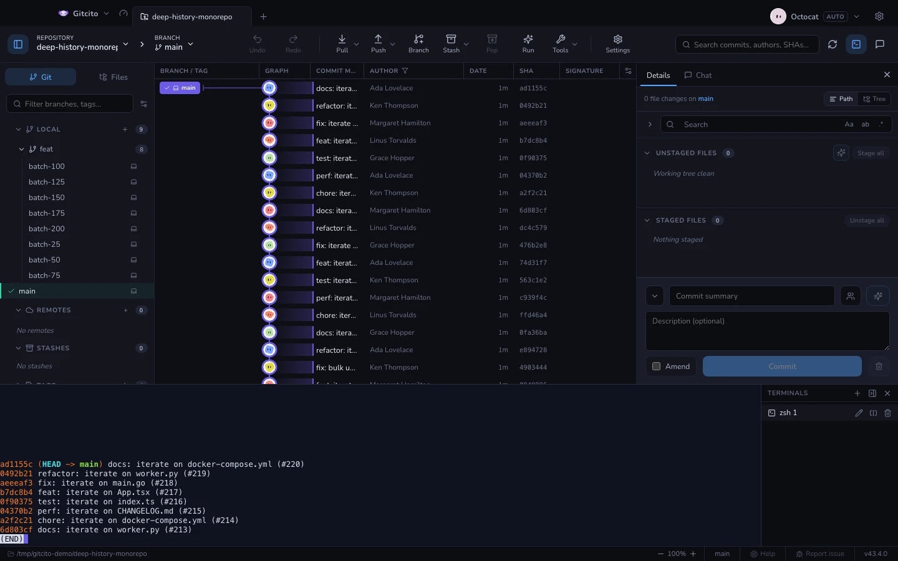
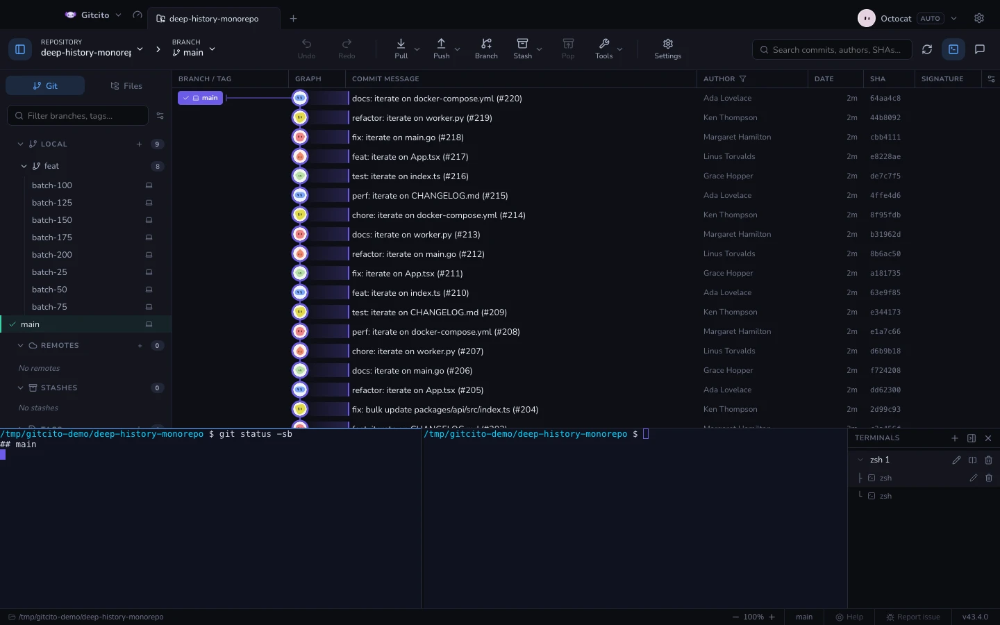

# Wbudowany terminal

Prawdziwy PTY (xterm + node-pty), a nie uruchamiacz poleceń. Twoja powłoka,
twój znak zachęty, twoje aliasy.

- **Wiele kart na repozytorium**, każda startująca w katalogu tego
  repozytorium.
- Zadokuj go **pod** grafem albo jako **prawą kolumnę**; panel pamięta swój
  rozmiar.
- Widoczność terminala jest per repozytorium: przełączenie się na kartę, która
  nigdy żadnego nie otworzyła, zostawia go zamkniętym.
- Karty nazywają się same, według tego, co w nich działa.
- Zwinięcie listy terminali kurczy ją do **szyny**: jedna ikona na terminal
  (terminale podzielone pokazują mini mapę paneli), kliknij, żeby przełączyć,
  kliknij prawym po zwyczajowe menu zmiany nazwy/podziału/ubicia.

Wszystko, co tutaj uruchomisz, jest niewidoczne dla własnego blokowania
Gitcito, więc długi `git rebase` wpisany ręcznie i kliknięcie w interfejsie
wciąż mogą się zderzyć — aplikacja odświeża się z dysku, gdy terminal coś
zmieni.

**Zobacz też:** [Uruchamianie i debugowanie](launch.md) · [Hooki](hooks.md)
