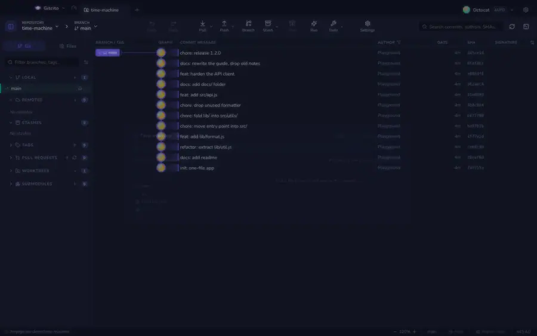

# Wehikuł czasu

Przeczytanie starego commita zwykle oznacza przełączenie się na niego, co oznacza
schowanie do stasha tego, co robiłeś. Tu tak nie jest.

Przeciągnij suwak, a **drzewo plików przerysowuje się dla każdego commita**:
katalogi się pojawiają, pliki wędrują między nimi, skasowane pliki wracają.
Wybierz plik, a czytasz go takim, jaki był w tym commicie.

Wszystko jest czytane z bazy obiektów (`git ls-tree`, `git show`). **Bez
przełączania, HEAD się nie rusza, twoja niezacommitowana praca zostaje
nietknięta** — możesz przewinąć rok historii w środku wprowadzania zmiany.

## Sterowanie

| Klawisz | Akcja |
|---|---|
| <kbd>←</kbd> <kbd>→</kbd> | Jeden commit |
| <kbd>⇧</kbd> + <kbd>←</kbd> <kbd>→</kbd> | Dziesięć commitów |
| <kbd>Home</kbd> / <kbd>End</kbd> | Najstarszy / najnowszy |

Strzałki po obu stronach suwaka robią to samo. Pliki, których dotknął bieżący
commit, są w drzewie podświetlone, a ich liczba stoi w nagłówku.

## Zaznaczenie przeżywa podróż w czasie

Wybierz plik i przewiń wstecz przed commit, który go stworzył: panel powie, że
tutaj go nie ma, i **zachowa twoje zaznaczenie**. Przewiń do przodu, a plik
wróci ze swoją starą treścią. I o to właśnie chodzi — przesuwasz repozytorium,
a nie swój kursor.

**Otwórz tę wersję** przekazuje plik zwykłemu widokowi pliku, w stanie z tego
commita.

**Zobacz też:** [Timelapse](timelapse.md) · [Blame i historia](blame.md)
