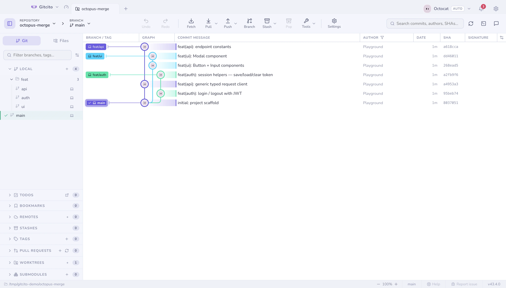
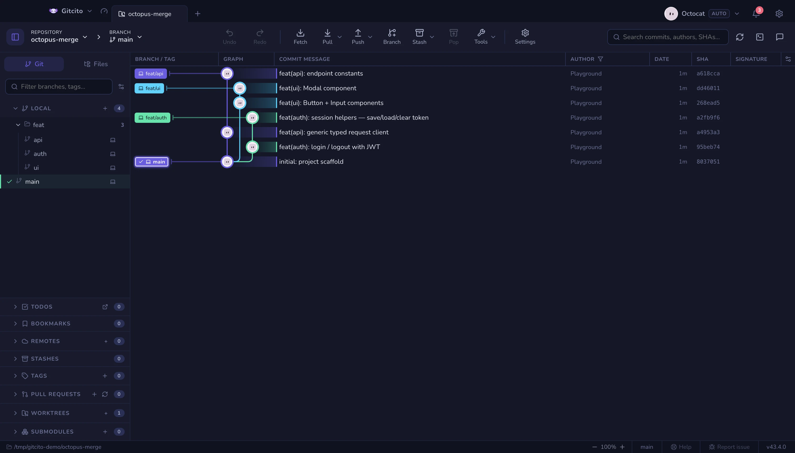
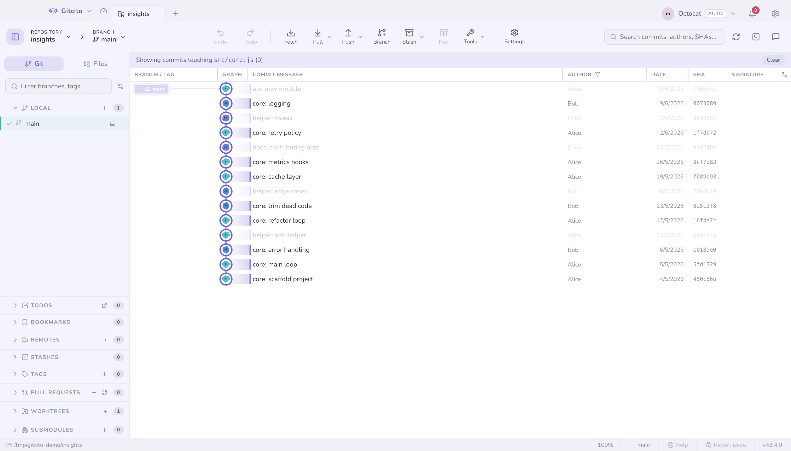
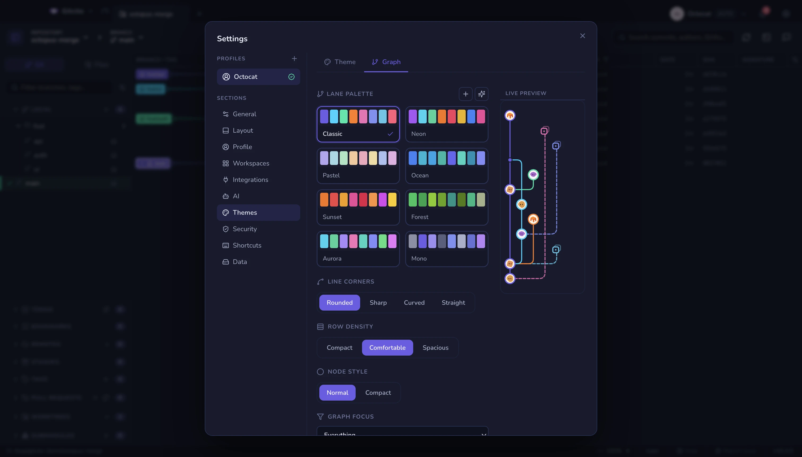
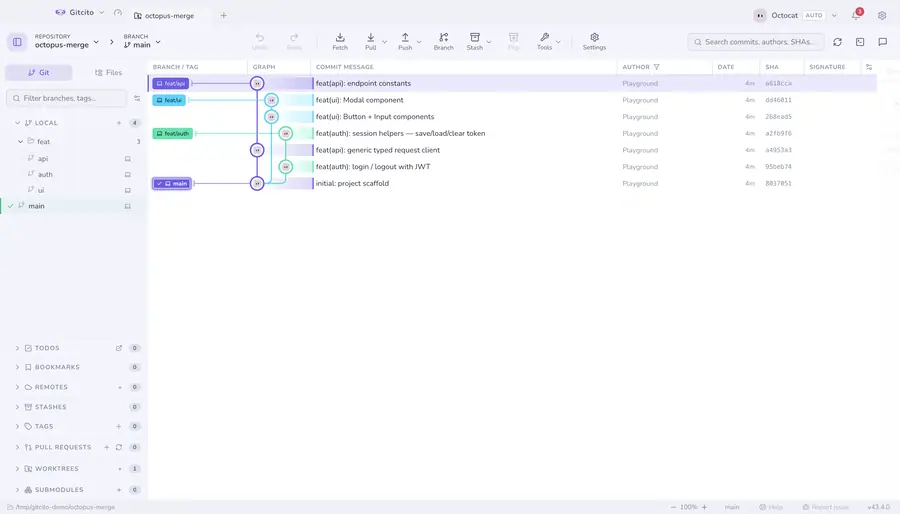

# O grafo de commits

Branches, merges e merges polvo desenhados direito, no claro ou no escuro. A
renderização é por janela, então um repositório com cem mil commits rola como um
com cem.

| | |
|---|---|
|  |  |

## Se movimentando

- <kbd>↑</kbd> <kbd>↓</kbd> (ou <kbd>j</kbd> <kbd>k</kbd>) andam com a seleção.
- <kbd>⌘</kbd>/<kbd>Ctrl</kbd>-clique alterna um commit numa **seleção múltipla**;
  <kbd>⇧</kbd>-clique pega um intervalo. Com vários selecionados, clique com o
  botão direito para fazer cherry-pick deles na branch atual, dar squash numa
  sequência contígua, exportar um patch combinado, ou copiar os SHAs.
- Commits que chegaram no seu **último fetch ou pull** são sinalizados como novos.
  Os que ainda não entraram no branch atual ficam levemente translúcidos até um
  pull trazê-los.
- Clique com o botão direito num commit para **Amend**, **Desfazer**,
  **Resetar para o commit…** e **Ver no GitHub**, além de checkout, cherry-pick,
  revert, branch, tag e cópia. Ações inseguras continuam visíveis e se
  desabilitam.

## Fazendo o grafo mostrar o que você quer

- O **foco do grafo** decide quanto histórico é desenhado — Configurações →
  Temas → **Grafo**, ou o menu da engrenagem no cabeçalho do grafo. *Tudo*
  desenha tudo; *Histórico linear* (first-parent) deixa só o tronco; *Ocultar
  ramos mesclados* mantém o tronco mais os ramos ainda não mesclados; *Modo solo*
  mantém o seu ramo, os ramos favoritos e o ramo padrão.

  Ele só filtra o que o log já carregou. *Ocultar ramos mesclados* confia na
  resposta do próprio git a "já contido no ramo atual", então trocar de ramo muda
  o que some — e mantém todo commit que ainda tenha uma tag ou uma ref que ele
  não reconheça apontando para ele, que é justamente o que um ramo apagado deixa
  para trás. *Histórico linear* e *Modo solo* são mais brutos: uma tag ou um
  stash num commit que eles escondem some junto.

- **Filtrar por caminho**: clique com o botão direito num arquivo ou pasta →
  *Filtrar grafo por este caminho*, e só os commits que o tocaram continuam acesos.

- **Colunas**: mostre, esconda, redimensione e reordene as colunas de branch,
  mensagem, autor, data, SHA, assinatura e deploy.
- **Estilo**: Configurações → Temas → **Grafo** — paleta de faixas (8 nativas,
  personalizada ou gerada por IA), estilo de canto, densidade das linhas e
  espessura dos traços, com uma pré-visualização ao vivo em mini-grafo.

## Onde os stashes sentam

Um stash é desenhado como uma linha própria, pendurado no commit de onde foi
tirado num esporão tracejado para não deslocar o tronco. Ele entra na linha
**logo acima desse commit pai**, não no lugar que o próprio carimbo de tempo
lhe daria.

O marcador é uma caixa de arquivo numa moldura pontilhada — o mesmo símbolo
de arquivo da lista de stashes, da paleta de comandos e do cabeçalho de
detalhes, para o grafo nomear um stash como o resto do app. A moldura
pontilhada é o que o separa de um commit: sentado uma linha acima do pai, a
forma precisa carregar «isto não faz parte do ramo».

Um stash quase sempre é mais novo que o commit em que se senta, então ordenar
por data o faria subir entre commits sem relação e esticaria o cabo pelo
meio do grafo. O pai é a única linha com que um stash realmente se relaciona,
então ele fica ao lado.

O limite: um stash cujo commit pai não está na janela carregada — podado, ou
além do fim do log — não tem âncora, e volta à ordem por data até o pai
carregar. *Histórico linear* e *Modo solo* descartam um stash cujo pai
descartam, como acima.

## Detalhes do commit

Selecionar um commit mostra os arquivos alterados dele (em árvore ou plano), autor,
SHA, coautores e a assinatura. Referências `#123` e `@menções` viram links
automáticos para o seu host.

A lista de arquivos se seleciona em grupo com os gestos de sempre (clique com
<kbd>⌘</kbd>/<kbd>Ctrl</kbd>, clique com <kbd>⇧</kbd>,
<kbd>⇧</kbd>+<kbd>↑</kbd>/<kbd>↓</kbd>). Clique com o botão direito na seleção
→ *Restaurar {n} arquivos na árvore de trabalho* pega esses arquivos exatamente
como este commit os tinha: depois de uma única confirmação sobrescreve as
cópias de trabalho, sem tocar em HEAD nem no índice.

**Veja também:** [Blame e histórico do arquivo](blame.md) · [Busca](search.md) · [Máquina do tempo](time-machine.md)
