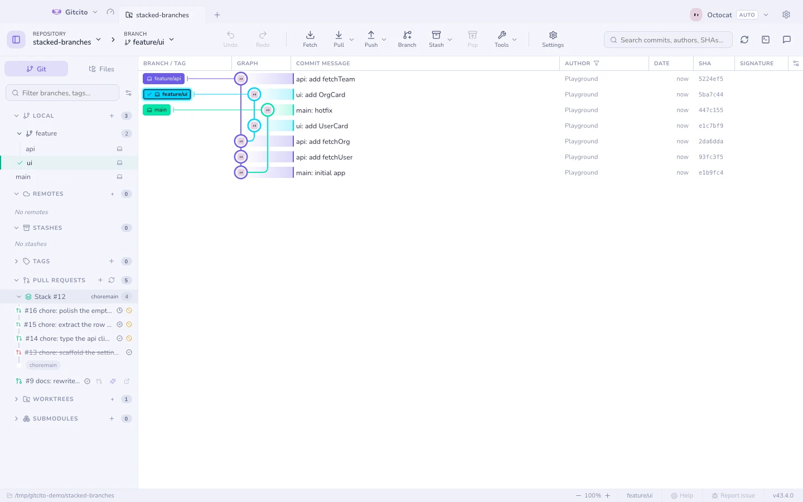

# Hosting e pull requests

## Criando

Crie um pull (ou merge) request sem sair do app: dropdowns de branch, título e
corpo pré-preenchidos a partir dos commits da branch, um interruptor de rascunho,
e — no GitHub — revisores, labels e responsáveis aplicados na criação.

Funciona no **GitHub, GitLab, Bitbucket e Azure DevOps**. PRs/MRs abertos dos
quatro são listados na barra lateral.

Comece um pela comparação de branches, pelo grafo, pelo `+` no painel de PRs, ou a
partir de uma issue (que preenche o `Closes #N`).

## Pilhas na lista

Pull requests apoiados uns nos outros se recolhem em uma única linha com ícone
de pilha, o branch em que a cadeia aterrissa e quantos são. Expanda para ver a
cadeia na ordem de leitura — da folha até a base — com uma setinha embaixo de
cada uma dizendo em que ela entra, então a direção fica na tela em vez de ser
deduzida de quatro bases.

Duas coisas formam esse grupo: o número de pilha do próprio GitHub, quando os PRs
pertencem a uma [pilha nativa](stacks.md), e senão as próprias refs — um pull
request cuja base é o head de outro se apoia nele. Essa segunda regra é o que faz
isso funcionar também no GitLab, Bitbucket e Azure DevOps.

Cada linha carrega o estado dos **checks** do seu head — passe o mouse para ver as
contagens — e, no GitHub, também os níveis já fechados ou mesclados, que uma lista
de PRs abertos esconderia. Um nível acima de um **fechado** fica marcado como
bloqueado: os checks dele podem estar verdes, mas o branch que ele mira nunca vai
aterrissar. As ações da linha aparecem no hover, para o título manter a largura.

Ler os checks custa uma requisição por pull request, e só quando a lista é
atualizada.

## Revisando — GitHub e GitLab

| | |
|---|---|
| **Conversa** | Comentários e estado da revisão |
| **Checks** | Execuções de CI (GitHub) ou jobs de pipeline (GitLab) com aprovado/falhou/pendente e links para os logs |
| **Arquivos vistos** | Um checklist de ✓ por arquivo, com progresso |
| **Threads inline** | Comentários de linha agrupados por `file:line`, e as respostas |
| **Ações** | Comentar, aprovar, pedir mudanças, e merge / squash |

Se alguém der force-push no meio da revisão, [o que mudou desde](range-diff.md)
mostra exatamente o que se mexeu.

As diferenças do GitLab, ditas com clareza: o GitLab não tem uma chamada única
de "enviar revisão", então **aprovar** usa o endpoint de aprovação dele e
**pedir mudanças** remove a sua aprovação e publica o seu comentário. O
**rebase-merge** não é oferecido — o GitLab decide entre merge-commit e
fast-forward pelas configurações do projeto, então o menu de merge mostra só
merge e squash. Threads inline mostram o arquivo e a linha, mas não o hunk de
diff ao redor, que a API do GitLab não retorna. Revisar e fazer merge funciona
para projetos no **gitlab.com**; instâncias self-hosted ainda não são
suportadas. Bitbucket e Azure DevOps ainda abrem no navegador para revisão.

## Issues, milestones, releases — GitHub

Navegue pelas issues e abra uma aba de issue completa: corpo, comentários, labels,
responsáveis, milestone, campos do Projects v2, fechar/reabrir, e **criar uma
branch para esta issue** (com nomeação por IA). Milestones mostram progresso e as
issues delas. Releases são navegáveis com uma página de changelog.

## Notificações — GitHub

Sua caixa de entrada inteira — pedidos de revisão, menções, atividade de CI — em
todos os repositórios, com filtros de não lidas/todas e marcar como lida. O sino da
barra de ferramentas carrega um selo de não lidas, e notificações de desktop
opcionais disparam quando uma revisão é pedida ou o CI termina.

## Tokens

Tokens por perfil para várias contas ou organizações, guardados no keychain do seu
sistema. O Gitcito também pode pegar emprestado o que o seu **credential helper do
git** já guarda, então uma organização em que você já se autenticou muitas vezes
não precisa de configuração nenhuma. Veja [Segurança e segredos](security.md).

**Veja também:** [Branches empilhadas](stacks.md) · [Recursos de IA](ai.md)
