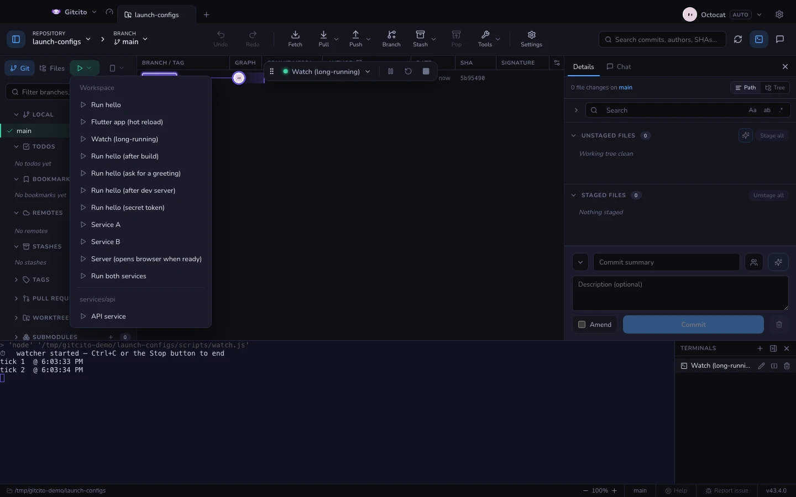
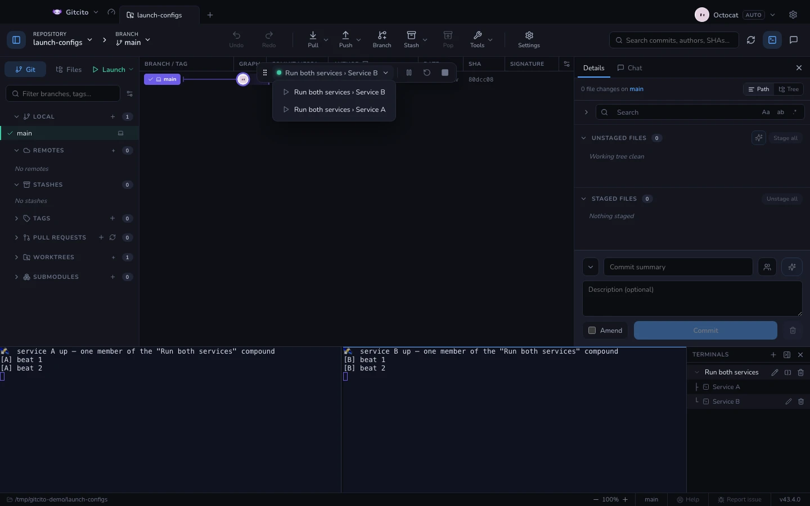

# Rodar e depurar

O Gitcito lê o seu `.vscode/launch.json` — o da raiz e quaisquer aninhados,
agrupados com divisórias — e roda a configuração que você escolher no terminal
integrado.

- As **variáveis do VS Code são resolvidas** (`${workspaceFolder}` e companhia).
- O **`preLaunchTask`** de uma configuração roda antes.
- Valores **`${input:…}`** são perguntados interativamente antes de lançar
  (`promptString` e `pickString`).
- Tarefas **`isBackground`** (watchers, servidores de desenvolvimento) rodam
  destacadas, então nunca bloqueiam o lançamento.
- Os **compounds** executam cada membro como sua **própria sessão paralela**,
  em um terminal dividido com o nome do compound — um painel por membro,
  exatamente como as sessões de depuração do VS Code. Com `stopAll: true`,
  parar um membro para todos.
  Tarefas compartilhadas por vários membros rodam **uma única vez**, em um
  painel próprio, antes de os membros iniciarem — um prompt de subir versão
  pergunta uma vez, não uma por membro.
  Esse painel se fecha sozinho em caso de sucesso e fica aberto se falhar.
- **`serverReadyAction`** é respeitada: quando a saída da sessão corresponde ao
  padrão configurado, a URL anunciada abre no seu navegador
  (`openExternally`; `debugWithChrome` / `debugWithEdge` também abrem o
  navegador — o Gitcito não consegue anexar um depurador).

Uma barra de ferramentas flutuante te dá **pausar / retomar, reiniciar, parar**, e
alterna entre as sessões em execução.

Ative em **Configurações → Geral → Habilitar launch.json**. O botão **LAUNCH**
aparece ao lado das abas Git / Arquivos.

Um membro de compound aparece como *compound › membro*, e reiniciá-lo
reinicia só aquele membro.

O que o Gitcito deliberadamente **não** faz: ele executa seus programas em
terminais reais, mas não é um depurador — sem breakpoints, sem inspeção de
variáveis, sem Debug Adapter Protocol. Configurações somente attach funcionam
quando carregam um `preLaunchTask` (a tarefa é o trabalho); um attach puro não
tem nada a executar.

**Veja também:** [Terminal integrado](terminal.md)
