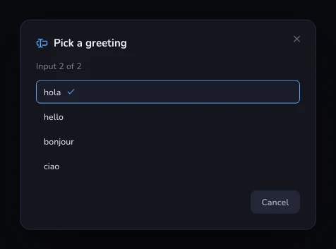
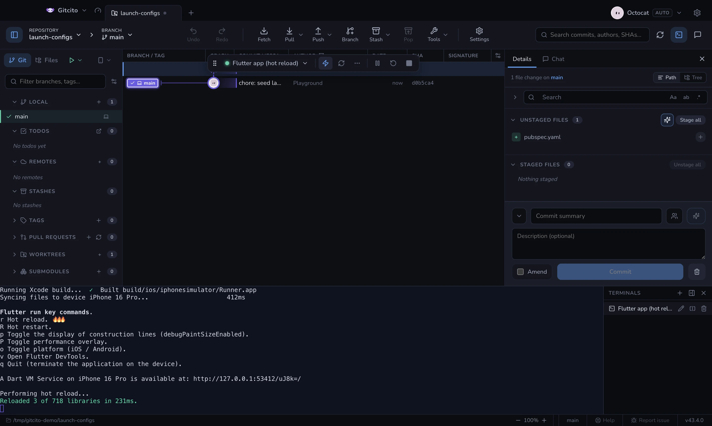
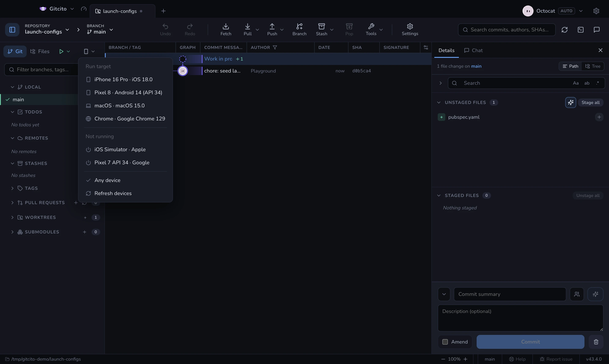

# Rodar e depurar

O Gitcito lê o seu `.vscode/launch.json` — o da raiz e quaisquer aninhados,
agrupados com divisórias — e roda a configuração que você escolher no terminal
integrado.


- As **variáveis do VS Code são resolvidas** (`${workspaceFolder}` e companhia).
- O **`preLaunchTask`** de uma configuração roda antes.
- Valores **`${input:…}`** são perguntados interativamente antes de lançar
  (`promptString` e `pickString`).
  Um `pickString` mostra suas opções como um seletor de verdade com o padrão
  pré-selecionado; um `promptString` marcado `password` é mascarado.
- Tarefas **`isBackground`** (watchers, servidores de desenvolvimento) rodam
  destacadas, então nunca bloqueiam o lançamento.
- Os **compounds** executam cada membro como sua **própria sessão paralela**,
  em um terminal dividido com o nome do compound — um painel por membro,
  exatamente como as sessões de depuração do VS Code. Com `stopAll: true`,
  parar um membro para todos.
  Tarefas compartilhadas por vários membros rodam **uma única vez**, em um
  painel próprio, antes de os membros iniciarem — um prompt de subir versão
  pergunta uma vez, não uma por membro.
  Esse painel se fecha sozinho em caso de sucesso e fica aberto se falhar.
- **`serverReadyAction`** é respeitada: quando a saída da sessão corresponde ao
  padrão configurado, a URL anunciada abre no seu navegador
  (`openExternally`; `debugWithChrome` / `debugWithEdge` também abrem o
  navegador — o Gitcito não consegue anexar um depurador).




Uma barra de ferramentas flutuante te dá **pausar / retomar, reiniciar, parar**, e
alterna entre as sessões em execução.

Ative em **Configurações → Geral → Habilitar launch.json**. O botão **LAUNCH**
aparece ao lado das abas Git / Arquivos.

Um membro de compound aparece como *compound › membro*, e reiniciá-lo
reinicia só aquele membro.
Se a barra cobrir algo de que você precisa, arraste-a para o lado pela alça —
a posição é lembrada, e um clique duplo na alça a centraliza de novo.

O que o Gitcito deliberadamente **não** faz: ele executa seus programas em
terminais reais, mas não é um depurador — sem breakpoints, sem inspeção de
variáveis, sem Debug Adapter Protocol. Configurações somente attach funcionam
quando carregam um `preLaunchTask` (a tarefa é o trabalho); um attach puro não
tem nada a executar.

## Ações a quente — o caminho rápido ao lado de Reiniciar



A maioria dos runtimes de desenvolvimento já recarrega com uma tecla:
`flutter run` no **r**, Metro no **r**, nodemon no **rs ⏎**, e o Vitest reexecuta
a suíte no **a**. Reiniciar a configuração de lançamento para conseguir o mesmo é
o caminho lento — mata o processo, roda de novo cada `preLaunchTask` e joga fora
o estado do app.

Por isso o Gitcito lê o comando que a configuração realmente inicia — seguindo um
`npm run dev` até os scripts do seu `package.json` — e coloca as teclas daquele
runtime na barra de depuração. Ao pressionar uma, a tecla é escrita na entrada
padrão da sessão, exatamente como se você a tivesse digitado no terminal.

| Runtime | Botões | Atrás de ⋯ |
|---------|--------|------------|
| Flutter (`flutter run`) | Hot reload `r`, hot restart `R` | debug paint, overlay de desempenho, troca de plataforma, DevTools |
| Expo | Recarregar `r` | menu de desenvolvimento, depurador |
| Metro / React Native | Recarregar `r` | menu de desenvolvimento, depurador |
| Vite (dev, serve, preview) | Reiniciar o servidor `r ⏎` | abrir no navegador, mostrar as URLs, limpar o console |
| nodemon | Reiniciar `rs ⏎` | — |
| Vitest (modo watch) | Rodar todos `a`, rodar os que falharam `f` | atualizar snapshots |
| Jest (`--watch`) | Rodar todos `a`, rodar os que falharam `f` | somente arquivos alterados, atualizar snapshots |
| Mocha (`--watch`) | Rodar de novo `rs ⏎` | — |
| AVA (`--watch`) | Rodar todos `r ⏎`, atualizar snapshots `u ⏎` | — |
| `dotnet watch` | Forçar o reinício `Ctrl+R` | — |
| Wrangler (`wrangler dev`) | Abrir no navegador `b` | DevTools, local/remoto, limpar o console |

Runtimes que recarregam sozinhos não ganham botões — `node --watch`, `ng serve`,
`tsc --watch`, `cargo watch`, `next dev`, webpack-dev-server. Um botão que envia
uma tecla que ninguém lê é pior do que botão nenhum, porque parece que funcionou.

**Os limites.** A detecção é textual: ela procura o nome do programa na linha de
comando, então uma configuração que sobe seu servidor por um script invólucro que
o Gitcito não consegue ler não recebe nada. Também não há confirmação — o botão
pisca, e a saída do próprio processo é a resposta de verdade. Uma sessão pausada
ou encerrada não aceita entrada, então os botões ficam desabilitados.

**Quando o palpite erra**, diga na própria configuração:

```json
{
  "name": "API (watch)",
  "type": "node-terminal",
  "command": "./scripts/dev.sh",
  "gitcito": { "hotActions": [{ "label": "Reload", "send": "r", "icon": "reload" }] }
}
```

`send` é escrito literalmente — termine com `\n` para uma CLI que espera Enter.
`icon` é opcional: `reload`, `restart`, `rerun`, `failed`, `snapshot`, `menu`, `debugger`,
`browser`, `clear`, `paint`, `perf`, `platform`, `devtools`, `urls`.
Um array `hotActions` vazio desliga os botões para aquela configuração.

## Destino de execução — em qual dispositivo a configuração roda



Uma configuração que compila um app móvel precisa saber onde rodar. Essa escolha
não é só do Flutter — React Native, Expo, Capacitor e xcodebuild também aceitam
um destino, cada um escrito de um jeito. Então o Gitcito pergunta uma vez, ao
lado da aba **LAUNCH**, e escreve a resposta na forma que o runtime daquela
configuração lê. O seletor só aparece quando alguma configuração do repositório
realmente aceita um dispositivo.

**De onde vem a lista** — das ferramentas de SDK que a máquina tiver,
consultadas em paralelo:

| Ferramenta | Contribui | Consultada |
|------------|-----------|------------|
| `flutter devices` / `flutter emulators` | tudo, já normalizado | se a pasta tem `pubspec.yaml` |
| `xcrun simctl` | simuladores iOS, ligados e frios | no macOS |
| `adb devices` | celulares Android e emuladores já ligados | sempre |
| `emulator -list-avds` | emuladores Android ainda frios | sempre |

O mesmo simulador é relatado por até três delas, então as entradas são
mescladas por plataforma e nome; no empate o Flutter ganha, porque o id dele é o
que `flutter run -d` espera. As ferramentas que faltam aparecem no rodapé do
menu — uma lista curta deve se explicar sozinha.

**O que a escolha faz:**

| Família | Escrito como |
|---------|--------------|
| Flutter | `-d <id>` |
| React Native iOS | `--udid <id>` |
| React Native Android | `--deviceId=<id>` |
| Expo `run:ios` / `run:android` | `--device <id>` |
| Capacitor / Ionic | `--target <id>` |
| xcodebuild | `-destination id=<id>` |
| qualquer outra | só ambiente |

Toda configuração lançada também recebe `GITCITO_DEVICE_ID`,
`GITCITO_DEVICE_NAME` e `GITCITO_DEVICE_PLATFORM` no ambiente, mais
`ANDROID_SERIAL` quando o destino é um Android de verdade. É isso que deixa um
script invólucro, uma task do Gradle ou um `adb` avulso acertarem o mesmo
aparelho sem o Gitcito reescrever nada.

**Ligar um dispositivo frio.** Tudo sob *Não iniciado* liga quando você escolhe:
`flutter emulators --launch`, `xcrun simctl boot` (mais a janela do Simulator) ou
`emulator -avd` desacoplado — assim fechar o Gitcito não derruba seu emulador
Android.

**Os limites.** Uma configuração que já nomeia um dispositivo — um `-d`
explícito, um `--simulator`, o `deviceId` do Dart-Code — fica intacta: o seletor
nunca sobrepõe o que o autor escreveu. Um id que precisaria de aspas cai para o
ambiente em vez de arriscar uma linha de comando quebrada. O menu é filtrado
pelo que suas configurações alcançam, então um repositório só de Android nunca
te oferece um iPhone. E a lista é um retrato: conecte um celular e aperte
**Atualizar dispositivos**.

A escolha é lembrada por repositório e esquecida quando aquele dispositivo deixa
de existir.

**Veja também:** [Terminal integrado](terminal.md)
