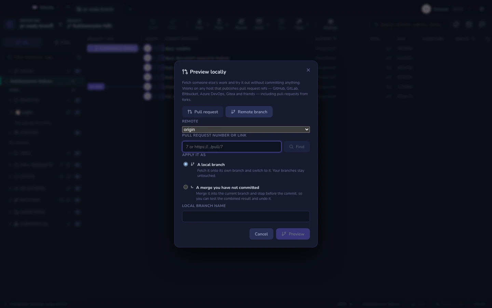

# Pré-visualizar um pull request

Revisar um diff no navegador te diz se o código se lê bem. Não te diz se o app
ainda sobe. Para descobrir isso você precisa rodar a branch — e é aí que as pessoas
travam, porque um pull request vindo de um fork mora num repositório que você nunca
clonou, muitas vezes um em que você não pode dar push.

A pré-visualização local resolve isso com um fato que a maioria nunca precisa
aprender: as forjas publicam a cabeça de todo pull request como uma ref git comum
**no repositório de destino**. O fork não precisa estar acessível, você não precisa
de token de API, e nenhum segundo remote é adicionado. Um fetch, e o código está no
seu disco.

| Host | Onde a cabeça do PR mora |
|------|-------------------------|
| GitHub, GitHub Enterprise, Gitea, Forgejo, Gogs | `refs/pull/<n>/head` |
| GitLab (nuvem e auto-hospedado) | `refs/merge-requests/<n>/head` |
| Bitbucket Cloud, Bitbucket Server | `refs/pull-requests/<n>/from` |
| Azure DevOps | `refs/pull/<n>/merge` |

O Gitcito sonda os quatro num único `ls-remote`, então uma forja desconhecida ou
auto-hospedada funciona desde que siga uma dessas convenções.

## Abrindo

- A lista de pull requests na barra lateral — o botão de seta em qualquer entrada.
  Isso funciona para todos os hosts, diferente da visão de detalhe, que é só do
  GitHub.
- A paleta de comandos: **Pré-visualizar pull request localmente**.
- Dentro da visão de detalhe de um pull request, ao lado do botão de "abrir no
  navegador".

## O que você fornece

**Remote** — o repositório *contra* o qual o pull request foi aberto, normalmente
`origin`. Não o fork.

**Pull request** — o número, ou uma URL colada do navegador. `7`, `#7` e
`https://github.com/owner/repo/pull/7` todos funcionam; os formatos de URL do
GitLab, Bitbucket e Azure DevOps também. Aperte **Encontrar** e o Gitcito reporta a
ref que resolveu e o commit para o qual ela aponta, antes de qualquer coisa ser
buscada.

**Branch remota** — a segunda aba, para quando não há ref de PR para encontrar: um
host que não as publica, ou uma branch que você simplesmente quer experimentar. Dê
o nome da branch como ele existe no remote.

## As duas formas de aplicar

Nenhuma das duas escreve um commit. Isso é deliberado — uma pré-visualização da
qual você não consegue ir embora não é uma pré-visualização.

| Modo | O que acontece | Como você desfaz |
|------|--------------|-----------------|
| **Uma branch local** | A ref é buscada para uma branch própria (`pr/7` por padrão) e colocada em checkout. Suas outras branches ficam intocadas. | O desfazer volta para a branch em que você estava e apaga a branch de pré-visualização. |
| **Um merge que você não commitou** | A ref sofre merge na branch atual com `--no-commit --no-ff`, deixando a árvore combinada preparada para você compilar e testar. | O desfazer aborta o merge. |

Pré-visualizar o mesmo pull request duas vezes reaproveita a mesma branch, movendo-a
para a nova cabeça — útil quando o autor envia uma correção enquanto você está
testando. Quando aquela branch já existe, o Gitcito diz isso e pergunta antes de
resetá-la, porque qualquer commit que more só ali seria perdido.

## O que ele não vai fazer

- **Ele não consegue inventar uma ref que o host não publica.** Algumas
  configurações auto-hospedadas desabilitam as refs de PR; algumas forjas nunca as
  tiveram. Você recebe um claro "nenhuma ref para #n" e a aba de branch remota como
  saída.
- **Ele não busca tags.** Uma pré-visualização não deveria arrastar o namespace de
  tags de outra pessoa para dentro do seu repositório.
- **O modo merge exige uma árvore de trabalho limpa.** O git recusa fazer merge por
  cima de trabalho não commitado; dê [stash](stashes.md) antes.
- **Uma pré-visualização não é uma revisão.** Ela coloca o código na sua máquina —
  não aprova, não comenta e não faz merge de nada. Isso é
  [hosting e pull requests](hosting.md).
- **Forks privados continuam privados.** A ref do PR é servida pelo repositório de
  destino, então o acesso segue as suas credenciais *daquele* remote — veja
  [segurança](security.md).

## Limpando

Uma branch de pré-visualização é uma branch comum: apague-a pela barra lateral
quando terminar, ou aperte desfazer logo depois da pré-visualização. Um merge de
pré-visualização deixado sem commit pode ser descartado com o desfazer, ou resolvido
e commitado se você decidiu que quer ficar com ele afinal — momento em que ele deixa
de ser uma pré-visualização e vira [um merge](merging.md).
