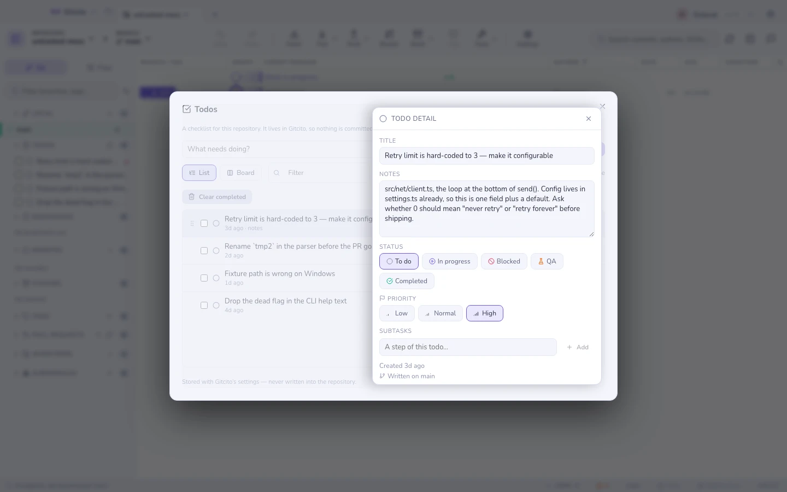
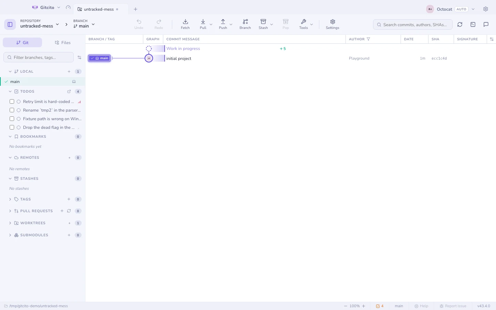

# Tarefas

Metade das anotações de quem programa tem uma linha e dura uma tarde:
*renomear aquela variável antes do PR*, *o caminho da fixture está errado*,
*perguntar sobre o limite de retentativas*. Um issue tracker é pesado demais
para isso, um arquivo de rascunho acaba commitado sem querer, e um post-it some
no instante em que você troca de repositório.

As tarefas são essa lista, presa ao repositório em que você está.

## Onde elas ficam

Em lugar nenhum do seu repositório. Uma tarefa é guardada com as configurações
do próprio Gitcito, indexada pelo caminho do repositório — e disso vêm três
consequências que vale conhecer:

- **Nada é commitado.** Nenhum arquivo aparece no `git status`, então uma tarefa
  nunca pega carona em um commit ou em um diff.
- **Mais ninguém vê.** É um bilhete para você, não um backlog compartilhado. Se
  a tarefa é do time, o lugar dela é uma issue.
- **Ela segue a pasta, não o branch.** Abra o mesmo clone em duas abas e verá
  uma única lista. Clone o projeto de novo em outro ponto do disco e você terá
  uma segunda lista, separada.

O branch em que você estava ao escrevê-la fica registrado como *contexto* e
aparece no detalhe. É um lembrete de onde você estava, não um filtro: as tarefas
não somem quando você faz checkout de outra coisa.

## Escrevendo uma

Abra a lista — o botão ↗ no cabeçalho da seção **Tarefas**, o chip da barra de
status ou **Tarefas** na paleta de comandos —, escreva a linha e pressione
<kbd>Enter</kbd>. A seção da barra lateral continua sendo uma lista para ler e
marcar; escrever acontece em um lugar só.

A ordenação já vem pronta: primeiro as abertas — prioridade alta acima da
normal, e esta acima da baixa — e, dentro de cada prioridade, a mais antiga
primeiro, porque o que está ignorado há mais tempo é o que merece ser visto. As
concluídas afundam, com a última marcada no topo, para que desfazer um clique
errado seja imediato.

## Vendo sem procurar

| Marca | Onde | O que significa |
|---|---|---|
| Chip <kbd>☑ 3</kbd> | Barra de status, à esquerda do branch | Quantas estão abertas; amarelo se alguma for de prioridade alta |
| Contador | O cabeçalho da seção na barra lateral | O mesmo número, ao lado da lista |

As duas somem no zero. Um “0 tarefas” permanente é mobília, e mobília é
exatamente o que as pessoas param de enxergar.

## O detalhe

Clique numa tarefa — na barra lateral, no chip da barra de status ou em
**Tarefas** na paleta de comandos — para abrir a lista completa com o painel de
detalhe.

| Campo | Para que serve |
|---|---|
| **Título** | A linha. Editado ali mesmo; não há botão de salvar. |
| **Notas** | Tudo o que o título não coube: por que importa, quais arquivos, o que é estar pronto. |
| **Prioridade** | Baixa, normal ou alta. Comanda a ordenação e a cor do chip. |
| **Criada / Concluída** | Quando você escreveu e quando marcou. |
| **Anotada em** | O branch que estava em checkout na hora. |

A mesma visão traz o filtro, a chave **Mostrar concluídas** e **Limpar
concluídas**, que apaga as marcadas de vez e pergunta antes.

## O que ela deliberadamente não faz

- **Sem prazos, sem lembretes, sem notificações.** Uma lista de tarefas que
  cobra é uma agenda; esta espera você olhar.
- **Sem sincronização e sem compartilhamento.** Ela não sai da sua máquina e não
  entra na exportação de um workspace.
- **Sem vínculo com issues ou commits.** Se uma anotação merece tanta estrutura,
  ela cresceu além desta lista — abra uma [issue](hosting.md).
- **Excluir é definitivo.** Não há entrada de desfazer ao remover uma tarefa,
  porque o git nunca a registrou.

**Veja também:** [Configurações por repositório](repo-settings.md) ·
[Central de controle](mission-control.md)
