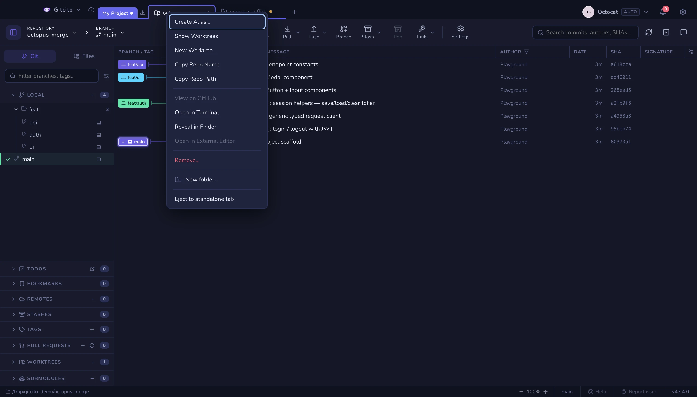
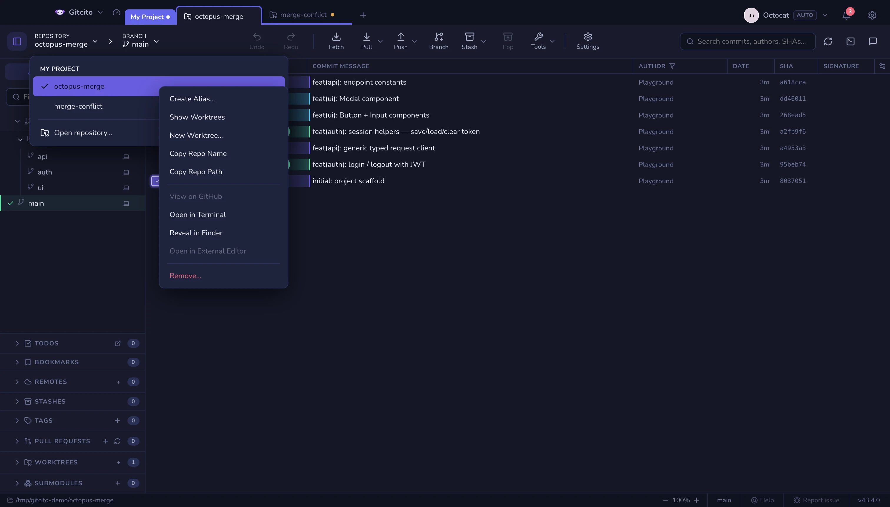

# Repository context menu

Right-click a repository — a standalone tab, a chip inside a group, a chip
inside a nested folder, a row in the welcome/launcher list, or a row in the
toolbar's repository dropdown — and you get the same repository-scoped menu.
The group chip itself still opens the group menu; the click has to land on the
repository.

The repository dropdown in the toolbar lists every open repository, the same
way the branch dropdown lists branches. Left-click a row to switch to it.
Right-click a row (or the current-repository pill itself) for alias, worktrees,
GitHub, terminal, reveal, editor and remove. **Open repository…** at the bottom
opens the launcher.

## What each action does

| Action | Effect |
|---|---|
| **Create Alias…** / **Change Alias…** | A display name only. Gitcito never renames or moves the folder on disk. The same alias follows the repository across tabs, groups and workspaces. |
| **Remove Alias** | Shown when an alias exists. Restores the folder name. |
| **Show Worktrees** | Focuses this repository and opens the sidebar's worktree section. |
| **New Worktree…** | Opens a repository-specific prompt. Choose an existing local branch and type or browse to a destination folder. Git requires an unused path or an empty folder, and refuses branches already checked out elsewhere. |
| **Copy Repo Name** | Copies the canonical folder name, not the alias. |
| **Copy Repo Path** | Copies the absolute path. |
| **View on GitHub** | Origin if it is github.com, otherwise the first parseable GitHub remote. Disabled when none can be derived. |
| **Open in Terminal** | Opens Gitcito's terminal with this repository as the working directory. |
| **Reveal in Finder / Explorer** | Highlights the repository folder in the platform file manager. |
| **Open in External Editor** | The editor configured in Settings. Visible but disabled until one is set. |
| **Remove…** | Closes the tab or drops the chip from the group. Uses the same uncommitted-work warning as the **×** button. It never deletes files from disk. |

A missing or invalid path keeps copy, alias and remove available, and greys out
anything that would open or inspect the directory.

The native Rust Repositories view puts secondary actions in each row's overflow
menu. **Copy Repo Name** and **Copy Repo Path** copy canonical folder name and
full path, even when that repository is missing. Existing repositories also have a reveal
action: macOS selects the folder in Finder, Windows selects it in File Explorer,
and Linux opens it in the default file manager.
The native row action **View on GitHub** prefers a GitHub `origin`, then checks
other remotes; selecting it reports when no GitHub remote is configured.
**Open in Terminal** starts a native shell tab with that repository as its
working directory and switches to the Terminal view.
**Open in External Editor** uses the executable configured in native Settings,
using configured folder arguments. It stays disabled until executable set.

**See also:** [Workspaces, tabs & groups](workspaces.md) · [Worktrees & submodules](worktrees.md) · [External editor](editor.md) · [Terminal](terminal.md)
