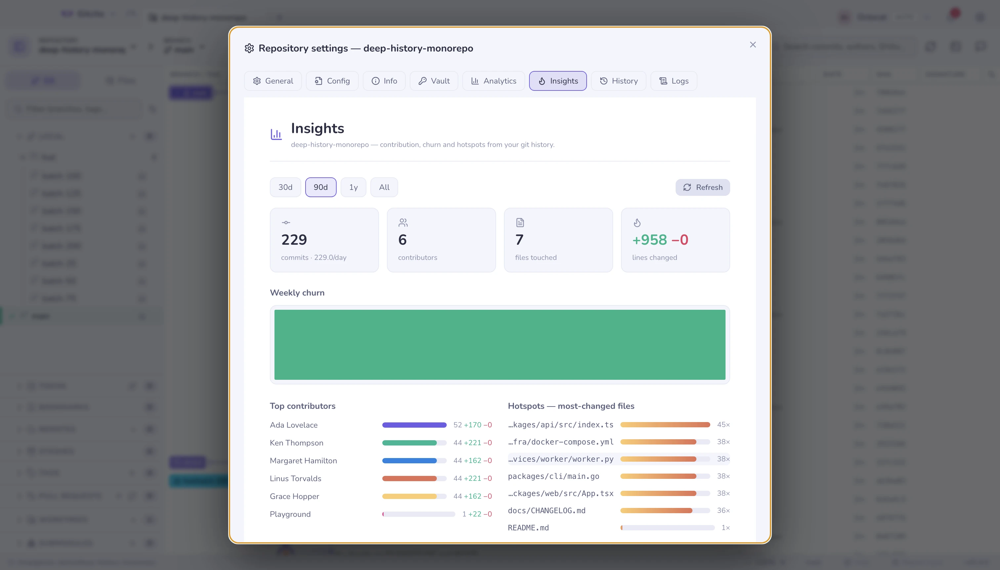

# Per-repository settings

The gear next to the toolbar tools opens settings that belong to **this**
repository, not the app.

| Tab | What it holds |
|---|---|
| **General** | Protected branches (a branch multi-select, stored in git config), signing |
| **Config** | The [rules this repository ships](repo-config.md) in `.gitcito.json`, and the doctor that checks them |
| **Info** | Free-form notes and fields about this repository, kept locally |
| **Vault** | This repository's [vault](vault.md) entries |
| **Insights** | The [history dashboard](insights.md) |
| **Analytics** | What you have done in this repository, counted locally |
| **History** · **Logs** | The operation log: every git command Gitcito ran, with its output |

The operation log is the honest one: when something behaves oddly, it shows the
exact command and the exact error, so a bug report can carry facts rather than
adjectives.

The native Rust preview lets you set comma-separated protected branch names or
patterns such as `release/*`. It defaults to `main` and `master`. Direct commits
to a protected branch ask for confirmation; force-push confirmation also warns
when its branch is protected. The list is stored in local Git config and can be
undone. Patterns in the committed `.gitcito.json` `protect` list are added to
the local list and cannot remove those protections.

**See also:** [Repository rules](repo-config.md) · [Security & secrets](security.md) ·
[Insights](insights.md)
