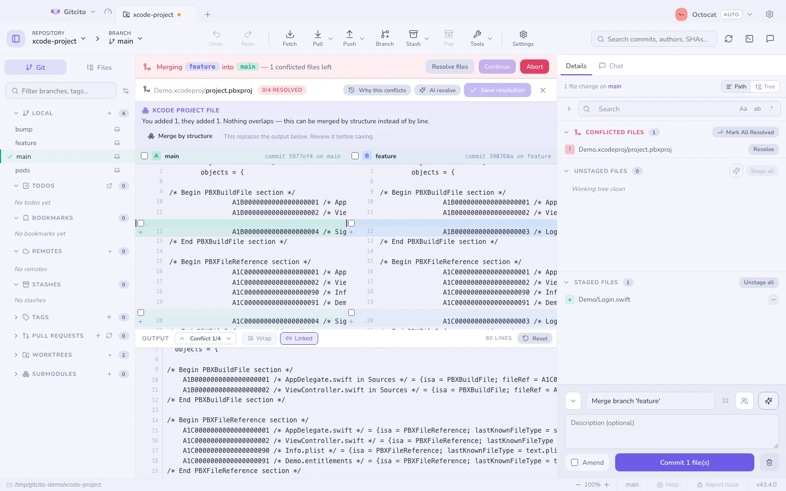
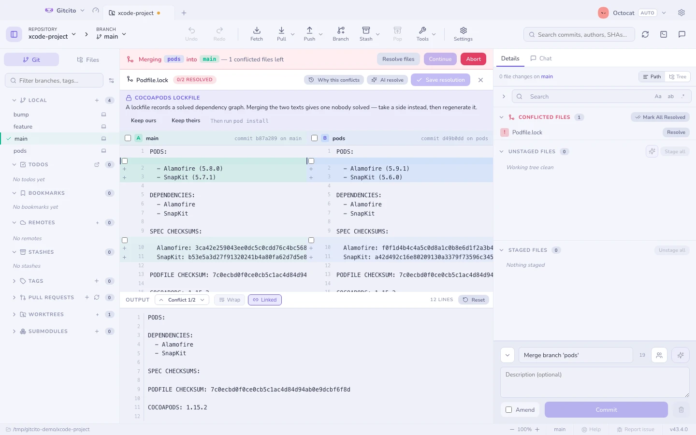

# Разрешение конфликтов

Когда слияние, ребейз, cherry-pick или revert останавливается, баннер сообщает,
**что** остановилось и **между чем** — «слияние `feature/x` в `main`», а не
просто «конфликт».

## Почему тут конфликт

**Почему тут конфликт** в шапке перечисляет по каждой стороне коммиты, которые
трогали этот файл с момента расхождения веток, — это `git log --merge`, который
есть в git испокон веков и которого никто не находит.

Маркеры говорят, что столкнулось. Это говорит, кто это изменил и зачем, — а
именно это обычно и решает исход. Пусто — значит, ни одна сторона не коммитила
изменение именно этого пути: столкновение пришло из переименования или переноса.

## Три панели

| Панель | Это |
|---|---|
| Левая | **Наша** — сторона, на которой вы были, подписанная своим коммитом |
| Правая | **Их** — приходящая сторона, подписанная своим коммитом |
| Средняя | **Результат**: редактируемый, с номерами строк, и именно он попадает в индекс |

Все три панели меняют размер, а в шапке результата живут два переключателя
вида:

| Переключатель | Что делает |
|---|---|
| **Перенос** | Переносит длинные строки в панелях A и B вместо прокрутки. Панель результата держит один ряд на строку — от этого зависят её боковые маркеры, — поэтому она всегда прокручивается |
| **Связано** | Прокручивает A, B и результат вместе, по вертикали и по горизонтали. Число строк у них разное, поэтому вертикальная позиция подгоняется пропорционально |

Перенос сначала выключен, Связано сначала включено, и оба запоминают своё
состояние.

## Как перемещаться

Открыв файл, вы попадаете на его **первый конфликт**, а не в начало файла.
Стрелки ⌃ / ⌄ в шапке результата — или <kbd>Alt+↑</kbd> / <kbd>Alt+↓</kbd> —
проходят по остальным, прокручивая все три панели к каждому из них.

## Как выбирать

По **строке**, по **фрагменту** или **всей стороной** сразу — а когда ответ
«оставить обе», можно взять обе стороны фрагмента. Навигатор по конфликтам
проводит вас по тому, что осталось, так что случайно оставить забытый маркер не
получится.

## Помощь ИИ

Если ИИ включён, **Разрешить с ИИ** предлагает вариант слияния в панели
результата. Сам он ничего не применяет: вы читаете, правите и индексируете. См.
[возможности ИИ](ai.md).

## Файлы проектов Xcode

`project.pbxproj` конфликтует чаще любого другого файла в iOS-репозитории — и
почти никогда потому, что кто-то с кем-то не согласился. Это один плоский
словарь объектов с 24-значными шестнадцатеричными ключами, поэтому добавление
одного файла пишет четыре записи: `PBXBuildFile`, `PBXFileReference`, строку в
`children` содержащей группы и строку в фазе сборки цели. Двое, добавивших по
файлу, пишут восемь записей, попадающих в одни и те же несколько строк. Git
видит столкновение; разрешать нечего.

Когда конфликтует именно `project.pbxproj`, редактор конфликтов читает все три
версии как проекты, а не как текст, и предлагает **слить по структуре**:
сопоставить объекты по идентификатору, взять каждое добавление с обеих сторон,
объединить массивы `children` и `files` и остановиться на том, что действительно
разошлось. Полоса над панелями говорит, что добавила каждая сторона и что — если
что-то — осталось на вас.

Как и предложение ИИ, результат попадает в панель вывода и ничего не
индексирует. Вы читаете его перед сохранением.

### Чего он не делает

**Он никогда не угадывает настройку, которую сдвинули оба.** Если вы поставили
`MARKETING_VERSION` в `1.1`, а они — в `2.0`, это решение, и оно названо в полосе
— настройка, ваше значение, их — вместо того чтобы разрешиться за вашей спиной.
Объект, который не удалось уладить, сохраняет *вашу* версию в точности, чтобы
наполовину применённое слияние никогда не попало на диск.

**Он отказывается от файла целиком, если хоть одна из трёх версий не
разбирается.** `project.pbxproj`, который Xcode не откроет, стоит дороже ручного
слияния, поэтому всё, что нельзя прочитать с уверенностью, остаётся обычным
текстовым конфликтом, и об этом сказано прямо.

**Он не распознаёт два идентификатора, выданных разным объектам.** Редкость, ведь
Xcode выбирает их случайно, — но если это случилось, взять любую сторону значило
бы молча потерять чей-то файл, поэтому о таком сообщают, а не сливают.

### Не `merge=union`

Ходячее средство от этого — `*.pbxproj merge=union` в
[`.gitattributes`](attributes.md). Не надо. Union работает, пока единственные
изменения — независимые добавления, а как только двое правят одну настройку
сборки, он выводит обе строки и порождает файл, который Xcode отказывается
открывать, — ровно тогда, когда вы меньше всего склонны внимательно читать
дифф. Структурное слияние даёт то же удобство без этого отказа.

## Lock-файлы

`Podfile.lock`, `Package.resolved`, `yarn.lock` и их родня фиксируют граф
зависимостей, который чей-то резолвер уже решил. Половина одного решения,
пришитая к половине другого, — это граф, который никто не решал: он может не
установиться, а если установится, установит то, чего не проверяла ни одна из
веток.

Поэтому, когда конфликтует именно lock-файл, полоса называет инструмент,
которому он принадлежит, предлагает тут же **Оставить наше** и **Оставить их**, и
даёт команду, которая создаст файл заново. Взять одну сторону здесь не
компромисс — это и есть весь метод, а правильным его делает пересоздание.

Три панели никуда не деваются: изредка вы и правда хотите прочитать, что
изменилось — узнаваемую контрольную сумму, ожидаемую версию. Именно от правки
руками это и отговаривает.

## Как не доводить до них вообще

[Радар конфликтов](conflict-radar.md) говорит, какие ветки конфликтнут, ещё до
того как вы начнёте их сливать.

## Пусть git запоминает (rerere)

Ребейзите долгоживущую ветку — и встречаете один и тот же конфликт каждый раз.
`rerere` — *reuse recorded resolution* — ответ git на это: он запоминает, как вы
уладили конфликт, и повторяет этот ответ, когда в следующий раз появится точно
такой же.

**Настройки → Общие → Запоминать разрешения конфликтов.** Это пишет
`rerere.enabled` в ваш глобальный конфиг git, так что командная строка ведёт
себя так же.

Когда git ответил за вас, резолвер прямо об этом говорит, вместо того чтобы
показывать пустой экран «маркеров конфликта нет», и предлагает **Забыть это
разрешение** — что стирает память *и* возвращает конфликт, чтобы вы могли
уладить его иначе.

Два момента, о которых стоит знать:

- **Повторённое разрешение не индексируется**, если только вы не включите
  *Автоматически индексировать повторённое разрешение*. Оставьте это
  выключенным: смысл паузы в том, что запомненный ответ может быть неверным
  именно для этого слияния, а индексирование не глядя — это ровно то, как он
  доезжает до коммита.

  Именно поэтому повторённый файл **остаётся в списке конфликтных**: git записал
  содержимое, но в индексе он всё ещё несмёрженный, и только индексирование это
  улаживает. Сдвигает его **Проиндексировать как есть** в резолвере или
  **Отметить всё разрешённым** в списке.
- **rerere понимает не всякий конфликт.** Конфликты «добавлено/добавлено» и
  «удалено/изменено» не дают прообраза, поэтому они всегда возвращаются сырыми.
  Счётчик в настройках показывает, сколько разрешений там реально лежит, а
  **Забыть все** его опустошает.

**См. также:** [Радар конфликтов](conflict-radar.md) · [Слияние и ребейз](merging.md)
