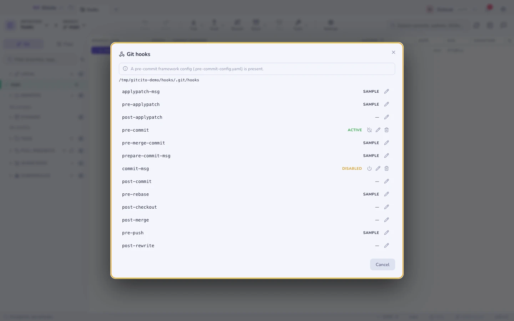
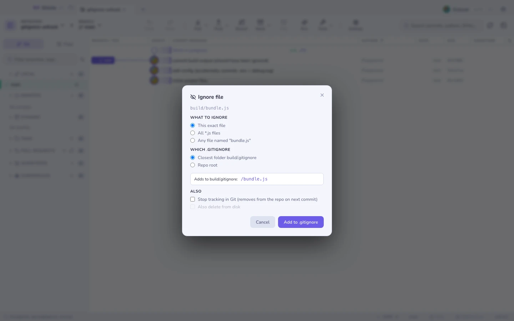

# Хуки и .gitignore

## Хуки

Список всех хуков репозитория: видно, какие из них настоящие, а какие всё ещё
`.sample`, и любой можно включить, выключить, отредактировать или создать.

Gitcito распознаёт нестандартный **`core.hooksPath`** (husky и компания) и
конфигурацию **фреймворка pre-commit** и сообщает, когда хуки лежат не в
`.git/hooks` — иначе вы правили бы файл, который git никогда не запускает.

> Для коммитов Gitcito хуки выполняются ровно так же, как для `git commit`. Хук,
> завершившийся с ошибкой, блокирует коммит, а его вывод возвращается в тексте
> ошибки.

## Умный .gitignore

Правый клик по файлу → **Игнорировать**, и выберите:

| Вариант | Что пишется |
|---|---|
| Этот файл | `path/to/file.log` |
| Все `*.ext` | `*.log` |
| Всю папку | `path/to/folder/` |

Правило попадает в `.gitignore` **ближайшей папки** или в корень репозитория, с
живым превью строки до того, как вы на неё согласитесь. Для уже отслеживаемых
файлов в том же диалоге есть **Игнорировать и снять с отслеживания**.

**См. также:** [Безопасность и секреты](security.md) · [Индексация](staging.md)
