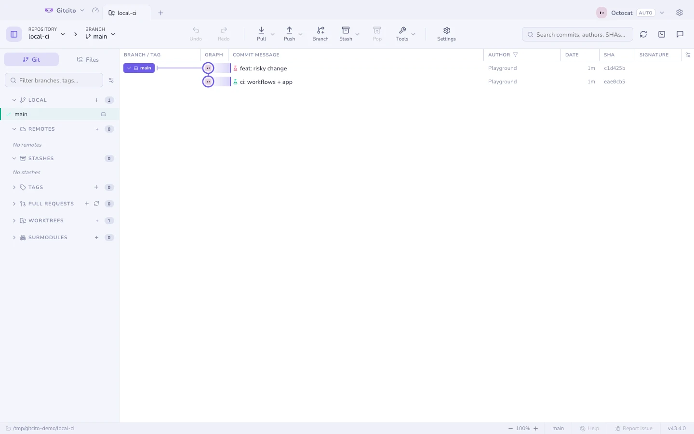

# Локальный CI

Цикл «push — ожидание — красный крестик — правка — push» съедает десять минут
на каждый круг. С [act](https://nektosact.com) те же воркфлоу выполняются в
контейнерах Docker на вашей машине, а Gitcito ими управляет: выберите
воркфлоу, нажмите «Запустить» и смотрите тот же лог, который напечатал бы CI —
до того, как что-либо покинет вашу машину.

## Интеграция, а не встроенная среда выполнения

Gitcito намеренно **не** поставляет act или Docker — приложение, тянущее за
собой контейнерную среду, это противоположность git-клиента. Это интеграция по
желанию: включите её в **Настройки → Интеграции** (или прямо в диалоге), и
Gitcito определит, что установлено, и проведёт вас через остальное —
`brew install act`, запущенный демон Docker, готово. Ничего не запускается,
пока не выполнены все три условия: интеграция включена, act установлен, Docker
доступен.

## Что он делает

- Перечисляет каждый воркфлоу из `.github/workflows` по его `name:`.
- **Запустить** выполняет воркфлоу через act на вашем **рабочем дереве** —
  вместе с незакоммиченными изменениями, и в этом весь смысл: тестируйте до
  коммита, а не после пуша.
- Вывод стримится в диалог вживую; **Остановить** прерывает запуск. Код выхода
  0 показывает **Успешно**, всё остальное — **Сбой** с кодом.

## Вердикты по коммитам на графе

Завершённый запуск прикрепляет свой результат к протестированному коммиту:
маленькая колба помечает строку в графе **зелёным или красным**, так что с
одного взгляда видно, какие коммиты уже пережили CI локально. Вердикт хранится
как git-заметка в `refs/notes/gitcito-ci` — локально на вашей машине, по
умолчанию никогда не пушится.

Правило честности: вердикт прикрепляется, только если рабочее дерево было
**чистым**. Запуск поверх незакоммиченных изменений тестировал то, чего нет ни
в одном коммите, поэтому он показывает результат в диалоге, но ничего не
помечает.

## Ограничения

- act — очень хорошая имитация раннеров GitHub, но не идеальная: экшены,
  которым нужны сервисы на стороне GitHub, секреты или экзотические образы
  раннеров, могут вести себя иначе. Локальный зелёный — сильный аргумент, но
  не гарантия.
- Один запуск на репозиторий за раз; старт следующего отменяет предыдущий.
- Только запуски целых воркфлоу — выбор отдельных джобов, матриц или событий —
  территория act; когда нужны флаги, запустите его в [терминале](terminal.md).
- Первый запуск скачивает образы раннеров — один раз будет медленно.

**См. также:** [Хостинги и пул-реквесты](hosting.md) · [Встроенный терминал](terminal.md)
