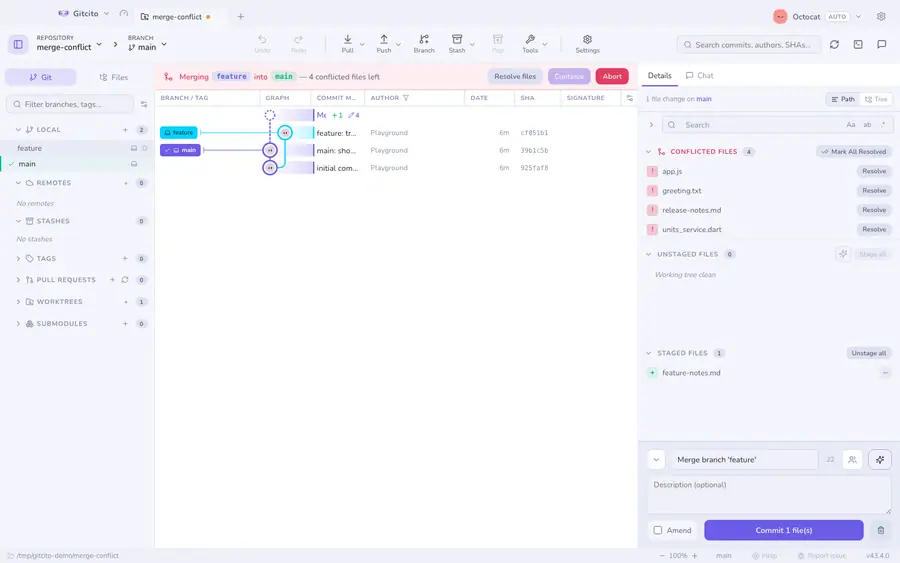
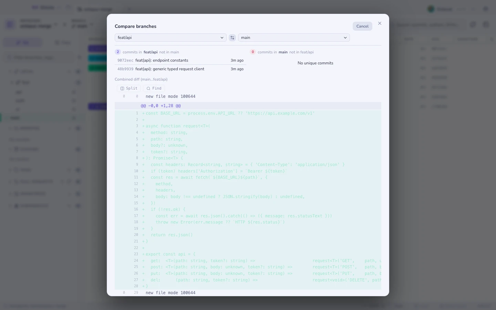
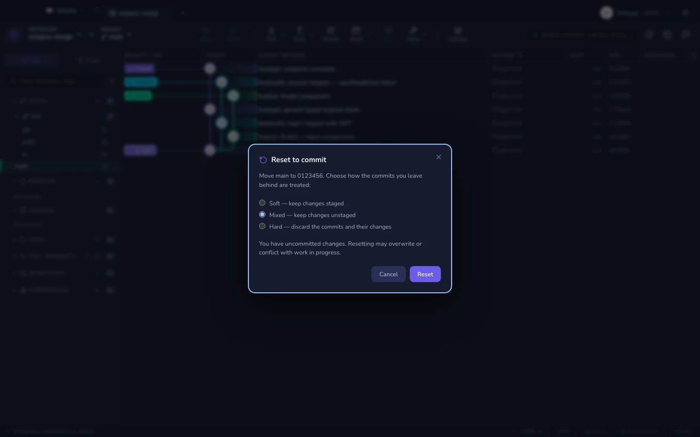

# Слияние и ребейз

## Из боковой панели

Правый клик по ветке даёт **Слить в текущую** или **Перебазировать на** — или
**Слияние с параметрами…**, когда обычное слияние — это как раз то, что
раз за разом идёт не так; см. [параметры слияния](merge-options.md).

## Перетащите одну ссылку на другую

Самый быстрый жест в приложении: возьмите ветку и бросьте её на другую. Gitcito
открывает небольшое меню того, что этот бросок мог бы означать, и не делает
ничего, пока вы не выберете.

Это работает в **обоих** местах, где показываются ссылки, — в строках веток,
удалённых веток и тегов в боковой панели и на цветных **бейджах ссылок в самом
графе**. Перетаскивайте между ними в любых сочетаниях; цель подсвечивается, пока
вы над ней держите.

| Бросок | Что означает |
|------|-------|
| **Слить {source} → {target}** | Выгружает цель и вливает в неё источник |
| **Перебазировать {source} на {target}** | Проигрывает коммиты источника поверх цели |
| **Сравнить** | Открывает [сравнение](#сравнить-любые-две-ссылки) — ничего не меняет |

**Меню предлагает только то, что git может сделать.** Слияние коммитит в цель,
поэтому цель обязана быть локальной веткой — нельзя слить в тег или в
отслеживающую ссылку удалённого репозитория. Ребейз переписывает источник,
поэтому источник обязан быть локальной веткой. Бросьте тег на удалённую ветку —
и всё, что вам предложат, это *Сравнить*, потому что больше действительно ничего
нет.

Ребейз сначала спрашивает подтверждение: он даёт каждому переигранному коммиту
новый хеш, а значит — форс-пуш, если ветка уже опубликована. Слияние не
спрашивает — оно только добавляет. В любом случае одна **Отмена** возвращает вас
назад.

## Слияние

Fast-forward, когда возможно, либо принудительный коммит слияния, когда вы
хотите, чтобы топология осталась записанной. Если возникнет конфликт, вы
попадёте в [резолвер](conflicts.md).

## Сравнить любые две ссылки

Выберите базовую и сравниваемую ссылку — ветку, тег или сырой SHA, с кнопкой
обмена местами — и получите счётчики «впереди/позади», коммиты, уникальные для
каждой стороны, полный совмещённый дифф и переход в один клик к **созданию
пул-реквеста**.

Доступно из боковой панели (сравнить с текущей веткой), из меню «Инструменты»
или по <kbd>⌘K</kbd>.

## Cherry-pick, revert, reset

Cherry-pick и revert живут в контекстном меню графа, как и всегда. **Reset** —
это один пункт, **Сбросить на коммит…**, вместо трёх сырых пунктов
soft/mixed/hard, которые противоречили друг другу.

Исправление, отмена и сброс стоят наверху меню одиночного коммита и остаются
**видимыми, когда они небезопасны**: они отключаются, а подсказка объясняет
почему. Отмена — только для неотправленного HEAD; исправление разрешено и для
опубликованного HEAD, но предупреждает, что понадобится форс-пуш. Сброс
дотягивается только до локальных предков плюс первого опубликованного коммита —
не до произвольной старой истории.

Диалог сброса делает режим явным:

| Режим | Результат |
|------|--------|
| **Soft** | Оставить изменения в индексе |
| **Mixed** | Оставить изменения вне индекса |
| **Hard** | Отбросить коммиты и их изменения |

Hard никогда не выбран заранее. Грязное рабочее дерево получает дополнительное
предупреждение, потому что сброс может перезаписать незавершённую работу или
войти с ней в конфликт. **Открыть на GitHub** живёт рядом с действиями
копирования и открывается только для опубликованных коммитов на удалённом
github.com.

Выделите несколько коммитов, и cherry-pick применит всё выделение, по порядку.

## Прежде чем что-либо сливать

[Радар конфликтов](conflict-radar.md) прогоняет каждую ветку против базы и
говорит, какие из них подерутся, ничего не выгружая.

**См. также:** [Интерактивный ребейз](rebase.md) · [Стеки веток](stacks.md) · [Радар конфликтов](conflict-radar.md)
