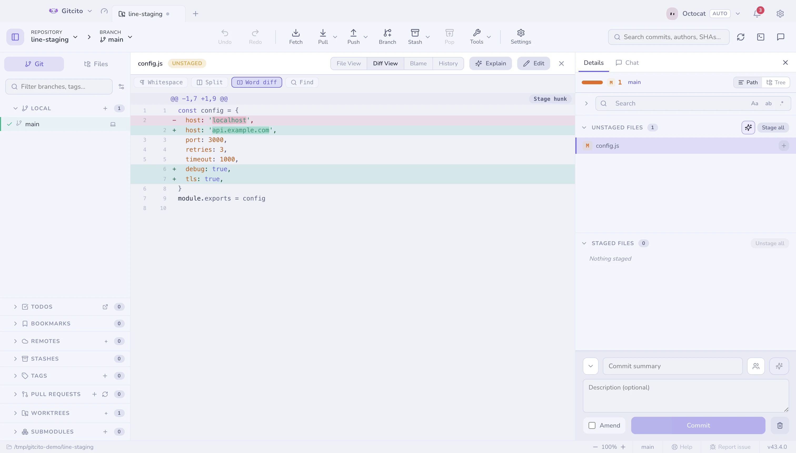

# Индексирование

В панели коммита три списка: **С конфликтами**, **Не в индексе** и **В индексе**.
Каждый сворачивается, и каждый помнит, в каком виде вы его оставили.

## Что изменилось, по виду

Заголовок над списками разбивает число на чипы: изменено, добавлено, удалено,
переименовано, с конфликтом. Те же цвета, что у глифов в строках. Вид без
файлов просто отсутствует, а не показывается нулём. Наведите на чипы, чтобы
увидеть обычную сумму.

Неотслеживаемые файлы считаются добавленными. Это единственное место, где сводка
индекса расходится со сводкой коммита: у коммита нет неотслеживаемых файлов.

## Три уровня точности

| Уровень | Как |
|---|---|
| **Файл** | Нажмите ✚ на строке или выделите несколько строк и добавьте всё разом |
| **Ханк** | Откройте дифф и нажмите кнопку в заголовке ханка |
| **Строка** | Выделите строки внутри диффа и добавьте именно их |

Индексирование по строкам — это то, что делает практичной привычку не тащить
отладочный `console.log` в коммит, не удаляя его заранее.

## Отмена изменений

Отмена работает на тех же уровнях и всегда переспрашивает. Неотслеживаемые файлы
удаляются; отслеживаемые возвращаются к своему проиндексированному (или
закоммиченному) состоянию.

## Клавиатура

<kbd>↑</kbd> <kbd>↓</kbd> (или <kbd>j</kbd> <kbd>k</kbd>) ходят по спискам
файлов, <kbd>⇧</kbd> — диапазон, <kbd>⌘</kbd>/<kbd>Ctrl</kbd> — переключение
отдельных файлов.

<kbd>⇧</kbd>+<kbd>↑</kbd>/<kbd>↓</kbd> расширяет выделение от последней
кликнутой строки. Правый клик по выделению — и всё в нём разом индексируется,
убирается из индекса, прячется в стеш или отбрасывается.

## Копирование путей

Правый клик по незакоммиченному файлу даёт **Копировать путь к файлу**
(абсолютный, с разделителями платформы) и **Копировать относительный путь к
файлу** (`src/index.ts`, без ведущего `./`). Несколько выделенных файлов
копируют по одному пути на строку, в порядке списка. Удалённые файлы остаются
доступны — копируется только текст. Папки по-прежнему копируют путь папки.

## Перед коммитом

Gitcito проверяет несколько вещей и спрашивает один раз — но никогда не молчит:

- файл, похожий на **секрет** (`.env`, `*.pem`, `id_rsa`…),
- **очень большой** блоб (порог в Настройки → Безопасность),
- коммит **прямо в защищённую ветку** (по умолчанию `main`/`master`).

Каждая из этих проверок предлагает *Игнорировать и снять с отслеживания* в один
клик. См. [Безопасность и секреты](security.md).

**См. также:** [Коммиты](committing.md) · [Диффы](diffs.md) · [Поглощение](absorb.md)
