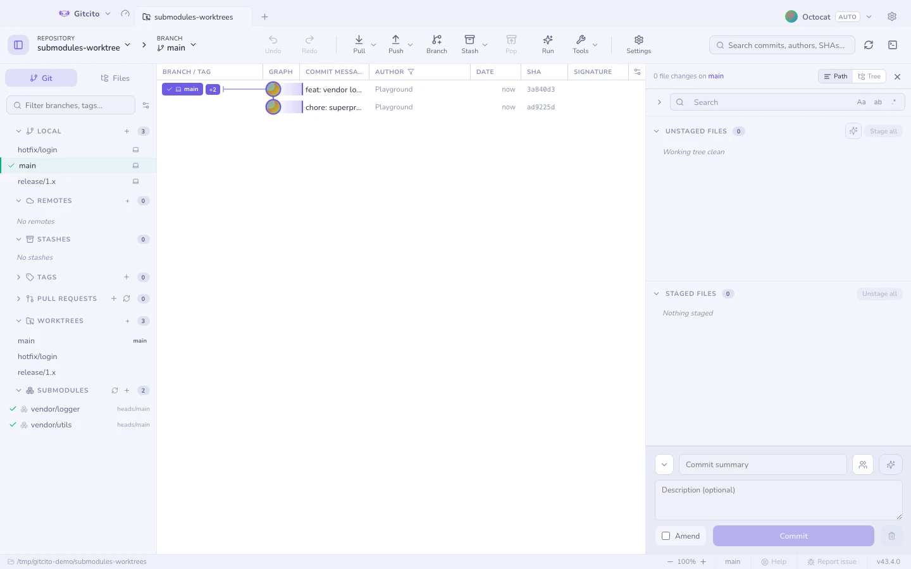
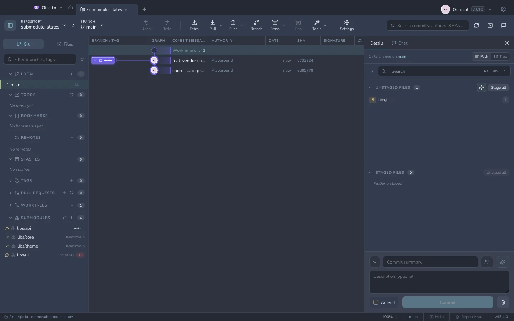

# Рабочие деревья и сабмодули

## Рабочие деревья

Рабочее дерево — это вторая выгрузка того же репозитория в собственной папке, так
что можно посмотреть на `main`, пока `feature/x` остаётся ровно в том виде, в
каком вы его оставили, и никакой стеш не нужен.

- Создавайте и удаляйте рабочие деревья из боковой панели. **Двойной клик**
  открывает дерево отдельной вкладкой; правый клик даёт *Открыть рабочее
  дерево*, *Показать в папке* и удаление.
- Правый клик по локальной ветке → **Открыть в рабочем дереве**, чтобы поднять
  его в соседней папке и открыть отдельной вкладкой.
- Ветка живёт только в одном рабочем дереве за раз, поэтому переключиться на
  ветку, которую держит другое дерево, невозможно — git отказывает словами
  *already used by worktree at …*. Gitcito вместо этого отводит вас туда: в меню
  ветки написано *Перейти к `x` в её рабочем дереве*, а двойной клик по строке
  открывает вкладку того дерева, а не выдаёт ошибку.

## Сабмодули

Добавляйте, обновляйте (init и checkout), синхронизируйте URL и удаляйте
сабмодули — со статусом каждого в реальном времени:

| Статус | Что означает |
|---|---|
| **Синхронизирован** | Выгружен на тот коммит, который записан у родителя |
| **Изменён** | Выгружен куда-то ещё или грязный |
| **Не инициализирован** | Записан, но ни разу не выгружался |

**См. также:** [LFS и sparse-checkout](lfs-sparse.md) · [Фетч, пул и пуш](syncing.md)
