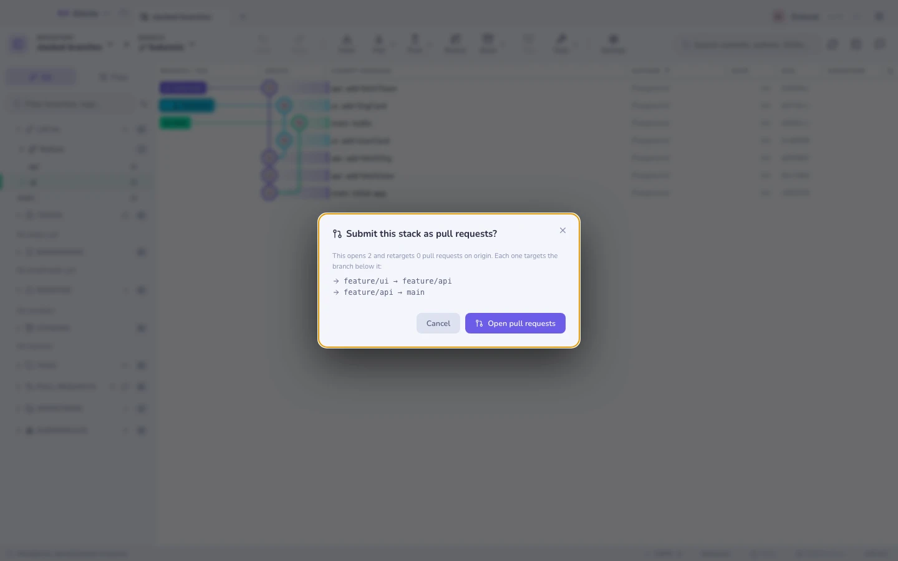

# Stacked branches

A stack is a chain of branches where each one builds on the one below:
`main → api → ui`. Reviewing three small PRs beats reviewing one enormous one.

Gitcito draws it as a **route**: a start branch at the top, then one stop per
level. Each stop's PR targets the stop above it, and the first stop lands on the
start branch. A stop shows its own commit count, whether it needs a restack, and
its PR number once submitted.

## Editing the route

**Nothing runs until you press Apply.** Picking a branch, moving a stop, taking
one off the route — all of it edits a list on screen. The real operation rebases
branches and checks them out, which is not something an exploratory click should
do. When the route reads right, **Apply route** performs it as one undoable
step; **Discard** puts the drawing back to what the repository actually says.

The route is drawn in merge order: the branch on top merges into the one below
it, down to the branch the stack lands on.

| Control | What it does |
|---------|--------------|
| The **Start** field | Where the stack lands. Change it and the whole chain re-links onto the new branch and replays. |
| A **stop's** field | Swaps which branch occupies that position. The branch that leaves is untracked, never deleted. |
| **↑ / ↓** | Moves a stop one place along the route. |
| **✕** | Takes the stop off the route; its neighbours join up. |
| **Add stop** | Pick a branch you already have and it joins the top of the route — or type a name that does not exist yet, and Apply creates it on the tip of the stop below. |
| The arrow button | Checks that stop out. This one is immediate — it is a checkout, not a route edit. |

Every field is a typeahead: type to filter, ↑/↓ and Enter to pick, and anything
you type that is not in the list still counts — so a remote-tracking ref like
`origin/main` works as a start branch.

Each of those edits is the *same* operation underneath: the whole route, handed
back at once. That is why one gesture is one undo entry (<kbd>⌘Z</kbd>) rather
than a trail of half-applied link changes.

## What a route edit costs

Anything that changes the order — a swap, a move, a different start — **replays**
the chain: each stop's own commits are rebased onto its new base. So it can
**conflict** — two stops that touch the same lines cannot swap without a human.
When that happens **nothing happens**: the whole edit is rolled back, tips,
parent links and the half-finished rebase alike, and Gitcito names the two stops
that clash. A dropdown you nudged should not strand you mid-rebase.

**Restack** is the other half of that bargain. It is a rebase you asked for by
name, so it does stop at the conflict and hand you the conflict view — which is
also the way to make a reorder that Gitcito refused: resolve there, then move the
stop.

Undo replays the previous route. It does not resurrect the old commits, because
the new ones are the same work with different parents.

## Push all

**Push all** pushes every level with `--force-with-lease` and stops there — `gh
stack push` without opening anything. **Submit stack as PRs** below does the
same push and then the PR work; use **Push all** when you want the branches on
the remote but are not ready for review.

## Submit the stack as chained PRs

**Submit stack as PRs** opens a screen of its own, because opening pull requests
is public and awkward to take back. It shows the plan first — how many it will
open, how many it will retarget, on which remote, and the `branch → base` line
for each — then runs in place, naming each step as it goes, and finishes on the
links: every pull request it touched, and the stack itself where GitHub made
one.

Behind that button it does in one click what stacking tools charge for:

1. Pushes every level with `--force-with-lease` (fresh branches tolerate it,
   restacked ones need it).
2. Opens a PR for every level that lacks one — each **based on its parent
   branch**, not on `main`, so every review shows only its own commits. Title
   and description come from the level's own commits.
3. Retargets any existing PR whose base has drifted.
4. Writes a **stack navigation section** into every PR body, so a reviewer on
   any level can see the whole chain and where this PR sits in it. That section
   is what makes the chain visible on GitHub, which has no notion of a stack —
   the bases alone only show up one PR at a time.

When it finishes, the screen lists what happened — click any row to open that
pull request.

The action is **idempotent**: press it after every restack, new level or merged
PR and it converges — nothing is duplicated, only what drifted is touched.

When the bottom PR has **merged**, the same button cleans up after it: the
merged level's child is reparented onto the trunk, the level is untracked, its
local branch deleted (safe — the trunk provably contains it), the chain
restacked and every remaining PR retargeted. Merge bottom-up, press Submit,
repeat.

### On GitHub it also becomes a real stack

Chained bases are what every host understands, and on GitLab, Bitbucket and
Azure DevOps they are all there is. GitHub has more: since its stacked pull
requests preview, a stack is an object on the server. Once the pull requests
exist, Gitcito registers them as one — bottom to top — and you get the stack map
in the PR UI, a cascading rebase run server-side, and a merge on the top PR that
lands every unmerged level below it.

If the repository is not in that preview, or the token cannot manage stacks, the
call is skipped without comment: the chain and its navigation section stand on
their own, exactly as they do on the other hosts.

## Restack

When a lower branch changes — you addressed review comments on `api` — every
branch above it is now built on the wrong base. **Restack** cascade-rebases the
whole chain with `rebase --onto`, so a parent rewrite does not duplicate commits
into its children. After a restack, press **Submit** again: it force-pushes the
rewritten levels and the PRs update in place.

## Limits

- Submission is **GitHub-only** for now (creation works on all four hosts, but
  retargeting and body updates need the GitHub API).
- The merged-bottom cleanup sees merge and rebase merges by ancestry, and
  **squash** merges by asking GitHub whether the branch's PR landed — so with a
  GitHub token every merge style is cleaned up. On other hosts, or without a
  token, a squash-merged level still needs a manual untrack. Fetch first, too —
  the ancestry check reads the trunk as of your last fetch.
- The stack section in a PR body is maintained between hidden markers — your
  own description above it is preserved.
- Reordering and changing the start **rewrite history** on every stop they touch. The
  The branches are yours and unpushed stops cost nothing, but a stop that is
  already under review gets a force-push on the next submit.
- A stop moves one place at a time. Two swaps are two rebases, and
  stopping halfway is a legible state; a drag that lands three places away is
  not.
- A stop gets **rebased**, so the branch the stack lands on is never also a stop,
  and neither is a **protected** branch — `main` and `master` unless you changed
  the list. Both are refused rather than quietly rewriting shared history.
- Submit asks the remote which branches actually arrived before it opens
  anything, and names the ones that did not. GitHub answers a missing head with
  a bare "Validation Failed", which is worth nobody's afternoon. The branch the
  stack lands on is checked too — if it is still only local, Submit offers to
  push it and carry on rather than failing on the bottom PR.

## Where the links live

Parent links are stored in **git config**, so they travel with the repository
and survive a reclone. Nothing lives in a service.

**See also:** [Interactive rebase](rebase.md) · [Hosting & pull requests](hosting.md)
