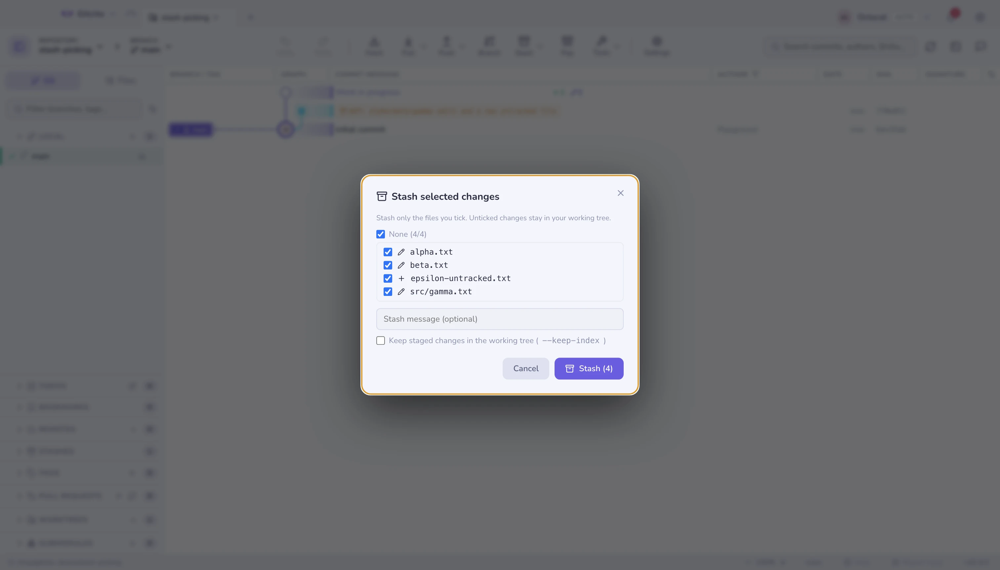

# Stashes

In the native Rust preview, Stashes has its own tab in Changes, alongside
Working tree and History. Stash creation, partial selection, stash list and
file previews stay together in that pane.

Stashing in Gitcito is not all-or-nothing.

| Action | What it does |
|---|---|
| **Stash** | Everything, including untracked files if you want, with a message |
| **Partial stash** | Tick just the files you want; optionally `--keep-index` |
| **Apply / Pop** | Whole stash, or **just some of its files** |
| **Stash → branch** | `git stash branch` — the escape hatch when a stash will not apply cleanly |

Selecting a stash shows its files and diffs, exactly like a commit. The header
above the list is the same per-kind breakdown. Its file list multi-selects with
the same gestures as [staging](staging.md) —
<kbd>⌘</kbd>/<kbd>Ctrl</kbd>-click, <kbd>⇧</kbd>-click,
<kbd>⇧</kbd>+<kbd>↑</kbd>/<kbd>↓</kbd> — and a right-click (or the *Apply n
files* button) restores just the selection.

## When a stash will not apply

If applying a stash would clobber untracked files, git stops. Gitcito offers to
overwrite them and retry, rather than leaving you to work out the incantation.

If the tree has moved too far, **stash → branch** recreates the branch the stash
was taken from, applies it there cleanly, and drops the stash.

**Native Rust preview:** saving a stash includes untracked files and can keep
staged changes in the index and working tree with **Keep staged changes in the
working tree**. The partial-stash panel lets you select dirty paths and undo a
successful stash. Stashes appear as selectable rows with a per-stash action
menu for branch, apply, pop and drop. Select a stash to list its changed paths,
then restore chosen files to the working tree while leaving the index and stash
intact; restore has guarded undo. Select a path to preview its diff;
credential-looking paths stay masked, and previews stop at 200 KB. Native path
selection supports
<kbd>⌘</kbd>/<kbd>Ctrl</kbd>-click to toggle files, <kbd>⇧</kbd>-click to extend
a range, and <kbd>⇧</kbd>+<kbd>↑</kbd>/<kbd>↓</kbd> to extend from the focused
path.

## Not to be confused with snapshots

[WIP snapshots](recovery.md) are automatic and hidden; stashes are deliberate
and listed. Snapshots never touch your stash list.

**See also:** [Recovery](recovery.md) · [Staging](staging.md)
