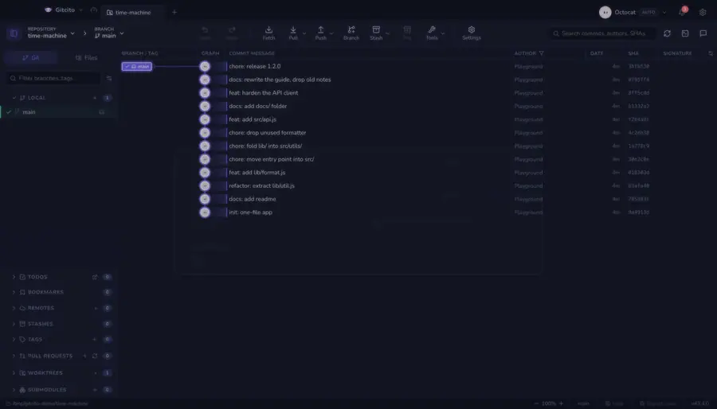

# Time machine

Reading an old commit usually means checking it out, which means stashing what
you were doing. This does not.

Drag the slider and the **file tree re-renders per commit**: folders appear,
files move between them, deleted files come back. Pick a file and you read it as
it was at that commit.

Everything is read from the object database (`git ls-tree`, `git show`). **No
checkout, HEAD never moves, your uncommitted work is untouched** — you can scrub
through a year of history in the middle of a change.

The native Rust preview adds a **Time machine** view. It moves through loaded
commits with older/newer controls or a slider, lists each snapshot's files,
marks paths changed by that commit, and previews the selected version from the
object database. Secret-looking files stay hidden. It does not check out a
commit while browsing. The native view navigates nested folders with breadcrumbs
and loads history in batches. Arrow keys move one commit, Shift plus arrows move
ten, and Home/End jump to oldest/newest; text input keeps its normal keyboard
behavior. Drag the divider between tree and preview to resize the tree from 220
to 440 points; it starts at 300.

## Controls

| Key | Action |
|---|---|
| <kbd>←</kbd> <kbd>→</kbd> | One commit |
| <kbd>⇧</kbd> + <kbd>←</kbd> <kbd>→</kbd> | Ten commits |
| <kbd>Home</kbd> / <kbd>End</kbd> | Oldest / newest |

The arrows either side of the slider do the same. Files the current commit
touched are highlighted in the tree, with a count in the header.

## Selection survives time

Pick a file and scrub back past the commit that created it: the pane says it
does not exist here, and **keeps your selection**. Scrub forward and the file
comes back with its old content. That is the point — you are moving the
repository, not your cursor.

**Open this version** hands the file to the normal file view at that commit.

In the native preview, **Restore file to working tree** copies the selected
commit's version into your working copy. Gitcito asks you to confirm first; the
index stays unchanged, Undo can recover the previous working copy, and
credential-looking paths get an extra warning. Browsing remains read-only until
you choose this action.

**See also:** [Timelapse](timelapse.md) · [Blame & history](blame.md)
