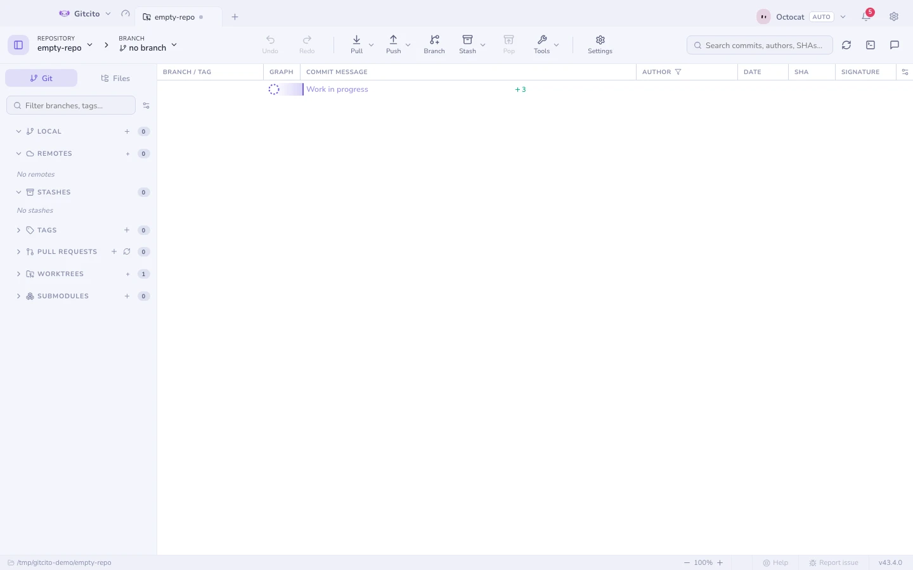
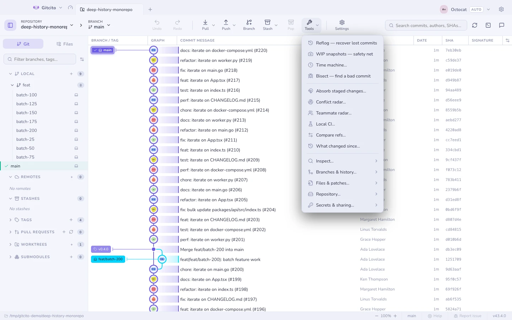

# Başlarken

Gitcito bir klasörü açar ve size geçmişini gösterir. Siz istemedikçe deponuza
hiçbir şey yazılmaz.

## Bir depo açın

- **Bir klasörü sürükleyip** pencereye bırakın ya da karşılama ekranındaki
  **Depo aç** düğmesini kullanın.
- Bir URL'den veya doğrudan barındırıcınızdan **klonlayın** — devasa bir depoyu
  hızlıca klonlamayı sağlayan seçenekler için [klonlama](cloning.md) sayfasına
  bakın.
- Terminalden `gitcito .` komutu, çalışan uygulamada geçerli klasörü açar —
  bkz. [komut satırı](cli.md).
- Henüz Git deposu olmayan bir klasör de açılır; Gitcito onu başlatmayı
  önerir.

## Üç panel

| Panel | Neler var |
|---|---|
| Sol | Dallar, uzak depolar, etiketler, stash'ler, çalışma ağaçları — ve çalışma dizini için **Dosyalar** sekmesi |
| Orta | Commit grafiği ve grafikten seçtiğiniz her şey |
| Sağ | Commit besteci paneli ya da seçili commit'in ayrıntıları |

## Geri kalan her şeyi bulmak

İki yol var ve ikisi de aynı yerlere çıkıyor:

- **`⌘K`** (`Ctrl+K`) — komut paleti. Ne istediğinizi yazın; dallara,
  commit'lere ve dosyalara da atlar.
- Araç çubuğundaki **Araçlar** — aynı depo kapsamlı küme, bu kez menü olarak;
  okunabilir kalsın diye uzun kuyruk gruplara katlanmış durumda.

Pencere daraldığında eylem çubuğu yer için yarışmayı bırakır: artık sığmayan düğmeler, çubuktaki sırayla ve kendi alt menüleriyle birlikte sonundaki **Daha** menüsüne katlanır. Pencereyi genişletin, geri çıkarlar.

Birinden ulaşılabilen her şeye diğerinden de ulaşılır; yani yalnızca uzman
kullanıcıların bulabildiği hiçbir şey yok.

## İlk commit'iniz

1. Bir dosyayı düzenleyin. **Hazırlanmamış** başlığı altında görünecektir.
2. Hazırlayın — dosyanın tamamını, tek bir hunk'ı ya da
   [tek tek satırları](staging.md).
3. Bir mesaj yazıp **Commit**'e basın.

Gitcito'daki diğer her şey isteğe bağlıdır.

