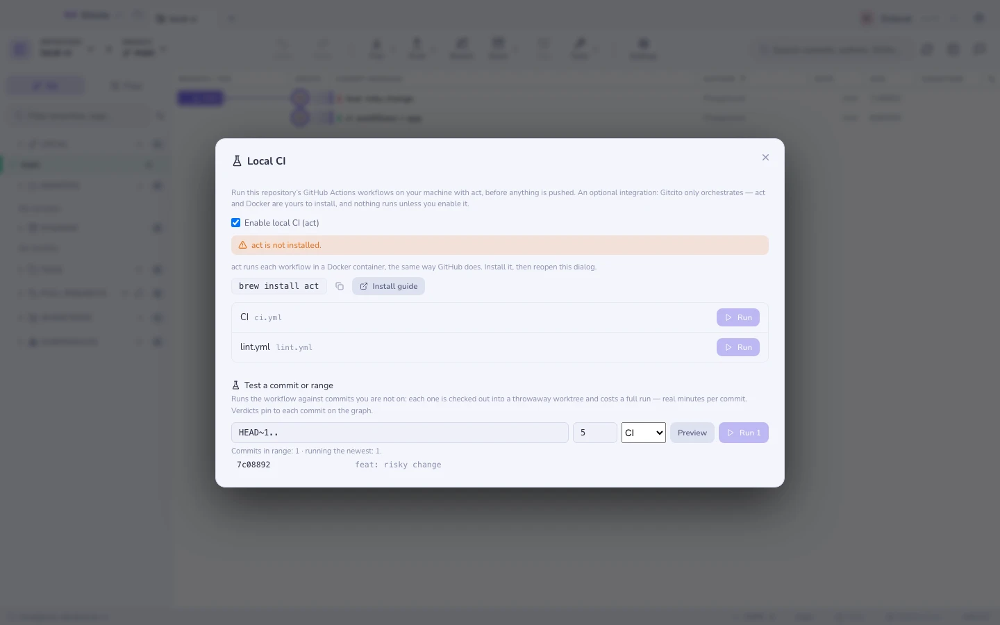

# Yerel CI

Push et–bekle–kırmızı çarpı–düzelt–push et döngüsü her turda on dakika harcar.
[act](https://nektosact.com) ile aynı iş akışları makinenizdeki Docker
konteynerlerinde çalışır ve onları Gitcito yönetir: bir iş akışı seçin,
Çalıştır'a basın, CI'ın basacağı logun aynısını izleyin — daha hiçbir şey
makinenizden ayrılmadan.

## Bir entegrasyon, paketlenmiş bir çalışma zamanı değil

Gitcito bilerek act veya Docker **içermez** — yanında bir konteyner çalışma
zamanı sürükleyen bir uygulama, git istemcisinin tam zıddıdır. Bu isteğe bağlı
bir entegrasyondur: **Ayarlar → Entegrasyonlar**'dan (veya diyaloğun
kendisinden) etkinleştirin; Gitcito neyin kurulu olduğunu algılar ve gerisi
için size yol gösterir — `brew install act`, çalışan bir Docker daemon'ı,
bitti. Üç koşul da sağlanana kadar hiçbir şey çalışmaz: etkin, act kurulu,
Docker erişilebilir.

## Ne yapar

- `.github/workflows` altındaki her iş akışını `name:` değeriyle listeler.
- **Çalıştır**, iş akışını act ile **çalışma ağacınıza** karşı yürütür —
  commit edilmemiş değişiklikleriniz dahil; mesele de tam olarak bu: push
  ettikten sonra değil, commit etmeden önce test edin.
- Çıktı diyaloğa canlı akar; **Durdur** çalıştırmayı sonlandırır. Çıkış kodu
  0 **Başarılı** gösterir, diğer her şey kodla birlikte **Başarısız**.

## Sınırlar

- act, GitHub çalıştırıcılarının çok iyi bir taklididir ama kusursuz değildir:
  GitHub'ın barındırdığı hizmetlere, secret'lara veya sıra dışı çalıştırıcı
  imajlarına ihtiyaç duyan action'lar farklı davranabilir. Yerelde alınan bir
  yeşil güçlü bir kanıttır, garanti değil.
- Depo başına aynı anda tek çalıştırma; yenisini başlatmak ilkini iptal eder.
- Yalnızca iş akışı düzeyinde çalıştırma — tek tek job'ları, matrisleri veya
  event'leri seçmek act'in alanıdır; bayraklara ihtiyacınız olduğunda onu
  [tümleşik terminal](terminal.md)'de çalıştırın.
- İlk çalıştırma çalıştırıcı imajlarını indirir — bir kereliğine yavaş
  olmasını bekleyin.

**Ayrıca bakınız:** [Sunucular ve pull request'ler](hosting.md) · [Tümleşik terminal](terminal.md)
