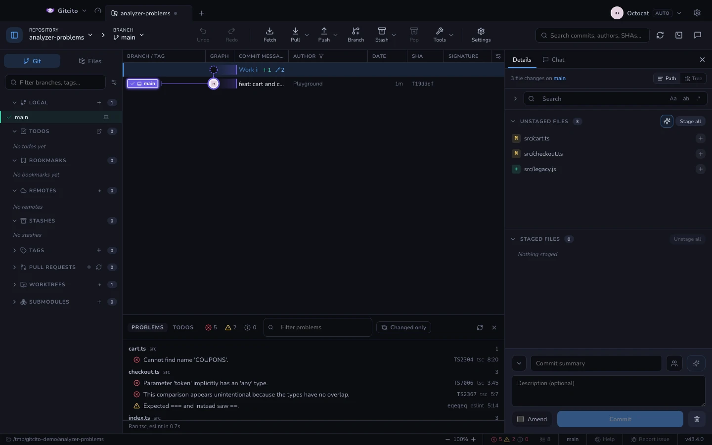

# Sorunlar

Her proje zaten neyin yanlış olduğunu söyleyecek bir araçla gelir — `tsc`,
`dart analyze`, ESLint, Clippy, `go vet`, Ruff. Hiçbirinin söylemediği şey ise az
önce bastığı kırk uyarıyı **senin** diff’inin getirip getirmediği. Gitcito hangi
dosyaların kirli olduğunu bilir; aynı liste bu soruyu tek bir düğmeyle
cevaplıyor.

Durum çubuğu sayacı taşır — hatalar, uyarılar, bilgiler: VS Code’un herkese
okumayı öğrettiği üç sayı. Tıkla (ya da komut paletinden **Sorunlar**) ve panel
altta açılır, dosyaya göre gruplanmış olarak. Bir satıra tıklamak dosyayı tam
orada açar. İlk taramadan önce sıfır yerine tire gösterir: henüz kimse bakmadı, üç sıfır ise aksini iddia ederdi.

## Ne çalıştırır

| Depoda şu varsa | Gitcito şunu çalıştırır |
|-----------------|--------------------------|
| `pubspec.yaml` | `dart analyze --format=machine` |
| `tsconfig.json` | `tsc --noEmit` |
| bir ESLint yapılandırması | `eslint -f json` |
| `Cargo.toml` | `cargo clippy --message-format=short` |
| `go.mod` | `go vet ./...` |
| `pyproject.toml` veya `ruff.toml` | `ruff check --output-format=json` |

**Flutter, Dart satırının içinde:** bir Flutter uygulaması Dart projesidir ve
`flutter analyze`, `dart analyze` ile aynı çözümleyiciyi çağırır.

**Proje kökte olmak zorunda değil.** Bu işaretler birkaç seviye aşağıda da
aranır; yani `mobile/` altındaki bir Flutter uygulaması ya da `apps/web`
altındaki bir paket bulunur ve her çözümleyici kendi proje dizininde çalışır. Bir
üst dizin zaten kapsıyorsa aynı türden iç içe proje atlanır — köke konmuş bir
`tsconfig.json` tam olarak bunu söyler — ve bir tarama on iki projede durur;
çünkü bir monorepo elli derleyici başlatmamalı.

**Ayarlar → Genel → Kod çözümleyicileri**, ne kadar istekli olacağını belirler:
panel açılınca tara (varsayılan), yalnızca yenile’ye basınca, ya da kapalı — ki bu
çözümleyici yarısını, durum çubuğundaki sayacını ve komutunu tümüyle gizler.

`node_modules/.bin` içindeki ikili, PATH’teki ikiliyi yener — projenin kendi
betikleri de tam olarak böyle çözümler. Her şey paralel çalışır ve her aracın
çıktısı tek bir biçime indirgenir, yinelenenler atılır ve sıralanır: aynı satırı
bildiren iki çözümleyici tek bir satır üretir.

**Hiçbir şey kendi başına çalışmaz.** Büyük bir depoda `tsc --noEmit` onlarca
saniyedir ve bu komutlar Gitcito’nun değil, deponun kendi araç zinciridir. Paneli
açtığında ya da yenilediğinde başlarlar, asla kendiliğinden. Liste bu yüzden bir
anlık görüntüdür: bir dosyayı düzenle, yeniden çalıştırana kadar bayattır.

**Üretilmiş çıktı elenir.** Proje köküne yöneltilmiş bir araç bulduğu her şeyi
denetler; bulduğu şeylerin arasında `.next/build/chunks`, paketlenmiş bir `dist`,
depoya alınmış bir kopya da vardır — makine yazımı koda dair yüzlerce şikâyet,
seninkine dair bir avuç şikâyeti gömer. Gitcito git’e hangi dosyaların yok
sayıldığını sorar ve onları eler; *izlenen* bir dosyayı ise asla elemez: üretilmiş
çıktıyı commit’lemek bir tercihtir ve `git check-ignore` buna saygı duyar.
`node_modules` her hâlükârda gider.

## Yalnızca senin değiştirdiklerin

Başlıktaki düğme, dokunmadığın dosyalardaki her sorunu eler. Açık tutmaya değen
görünüm budur: bir kod tabanındaki tüm uyarıların düz listesi bir hafta içinde
duvar kâğıdına döner; oysa "bu diff mi ekledi" commit’ten önce cevaplanmaya
değer bir sorudur.

Önem düzeyi rozetleri de süzer. Sönükken *hepsini göster* demektir; birini
yakmak listeyi ona daraltır.

## Sınırlar

- **Dil sunucusu yok.** Bu bir tarama, bir arka plan servisi değil: yazarken
  kırmızı çizgiler yok, sen istemeden sonuç yok.
- **Kurulu olmayan araç saklanmaz, adı yazılır.** Alt bilgi neyin
  çalıştırılamadığını söyler; açıklamasız boş bir liste, gerekçeli kısa bir
  listeden kötüdür.
- **Yalnızca makine okunur çıktı anlaşılır.** Her çözümleyici belgelenmiş makine
  biçiminden okunur; başka bir şey basacak şekilde ayarlanmış bir araç burada
  görünmez.
- **Tavan beş bin sorundur.** Ötesinde panel bunu söyler ve durur — o durumdaki
  bir deponun kaydırma çubuğundan daha büyük bir sorunu vardır.

**Ayrıca bakınız:** [Yerel CI](local-ci.md) · [Gömülü terminal](terminal.md)
