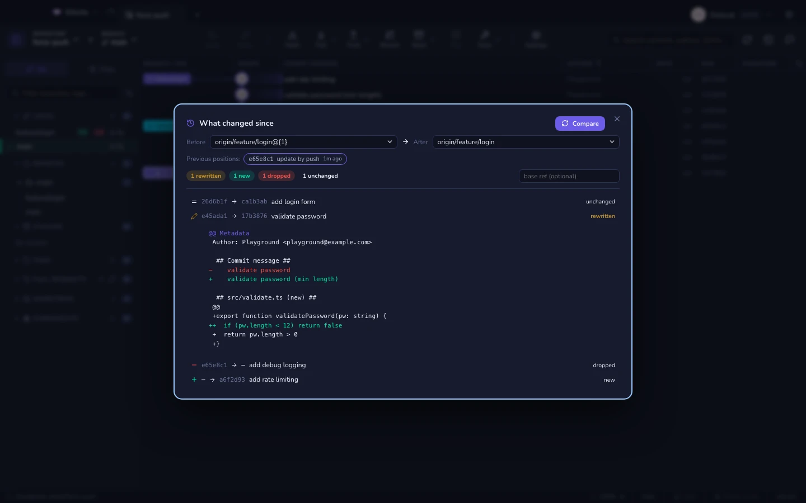

# O günden beri ne değişti

Bir dalı gözden geçirdiniz. Biri onu rebase edip force-push yaptı. Normal bir
diff artık işe yaramaz: bir rebase'den sonraki her commit yeni bir commit'tir,
dolayısıyla her şey yeniymiş gibi görünür.

`git range-diff` iki sürümü commit commit eşleştirir; Gitcito da eski konumları
doğrudan **reflog**'dan okur — yani bunun çalışması için önceden hiçbir şeyin
kaydedilmiş olması gerekmez.

| Karar | Anlamı |
|---|---|
| **Yeniden yazıldı** | Aynı commit, değişmiş. Interdiff için genişletin — tüm dosya değil, mesajdaki rötuş ve eklenen kontrol. |
| **Yeni** | Siz baktıktan sonra eklenmiş. |
| **Düşürüldü** | Siz baktıktan sonra kaybolmuş. |
| **Değişmedi** | Yeniden yazmadan dokunulmadan çıkmış. |

## Oraya nasıl gidilir

- **Yeniden yazılmış geçmiş bulan bir fetch bunu size söyler.** Bir bildirim
  dalın adını verir ve Uzak depolar altındaki satırına, tıklayarak
  karşılaştırmayı tam olarak dalın eskiden işaret ettiği commit'te açabileceğiniz
  bir **⟳** eklenir.
- Herhangi bir dala sağ tıklayın → *O günden beri ne değişti…*
- <kbd>⌘K</kbd> → *O günden beri ne değişti*

## Önceki konumlar

Ref alanlarının altındaki çipler dalın reflog'udur: zorla güncellemeler,
rebase'ler, reset'ler; her biri ne zaman olduğuyla birlikte. Birini seçin,
karşılaştırma ona göre yeniden çalışsın. Özelliğin tamamı bu — bir dalın
nerelerde bulunduğunun geçmişi zaten diskinizde duruyor.

**Ayrıca bakınız:** [Çakışma radarı](conflict-radar.md) · [Kurtarma ve reflog](recovery.md)
