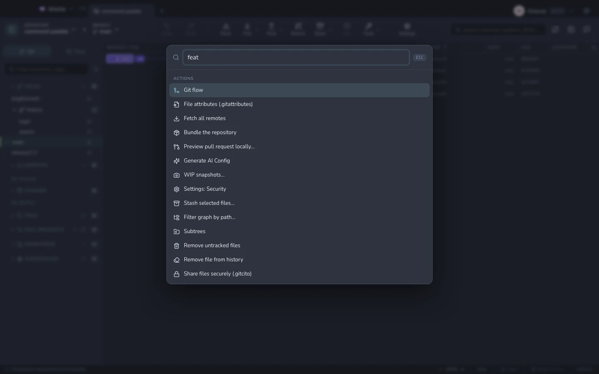
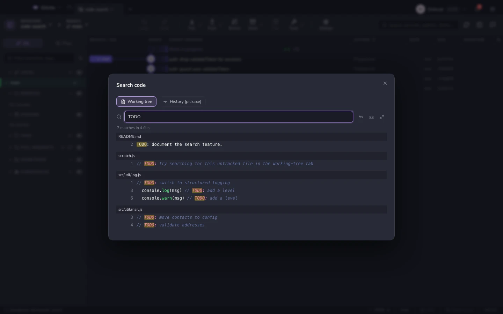

# Komut paleti ve arama

## Palet — <kbd>⌘K</kbd>

Bulanık eşleşmeyle bir **dala** (checkout eder), bir **commit'e** (grafiği ona
kaydırır), bir **çalışma dizini dosyasına** ya da bir **eyleme** atlayın —
fetch, pull, push, stash, terminal, reflog, ayarlar ve bu el kitabındaki her
özellik.

Palet öğrenir: son kullandıklarınız başa gelir, sık kullandıklarınız
kullanmadıklarınızın önüne geçer.

## Kod arama — <kbd>⌘⇧F</kbd>

Tek bir pencerede iki ayrı soru:

| Kip | Yanıtladığı soru |
|---|---|
| **İçerik** | "Bu metin şu anda nerede?" — izlenen *ve* izlenmeyen dosyalar üzerinde `git grep`; büyük/küçük harf, tam sözcük ve regex seçenekleriyle. |
| **Geçmişte pickaxe** | "Bu metin ne zaman ortaya çıktı ya da kayboldu?" — `git log -S` / `-G`. |

Sonuçlar sözdizimi renklendirmesiyle ve eşleşme işaretlenmiş olarak gelir;
dosyaya göre gruplanır ve tam satırları görecek şekilde açılır. Birine
tıklayarak dosyayı o satırda ya da onu getiren commit'i açın.

## Grafiği filtreleme

Grafiğin üstündeki arama kutusu commit'leri mesaja, yazara, SHA'ya veya dağıtım
durumuna göre filtreler. "Yalnızca bu dosyaya dokunan commit'ler" için yol
filtresini kullanın — bkz. [commit grafiği](graph.md).

**Ayrıca bakınız:** [Commit grafiği](graph.md) · [Klavye ve kısayollar](keyboard.md)
