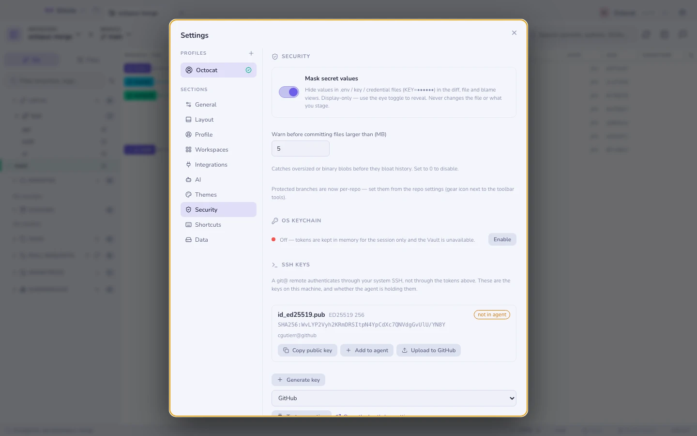
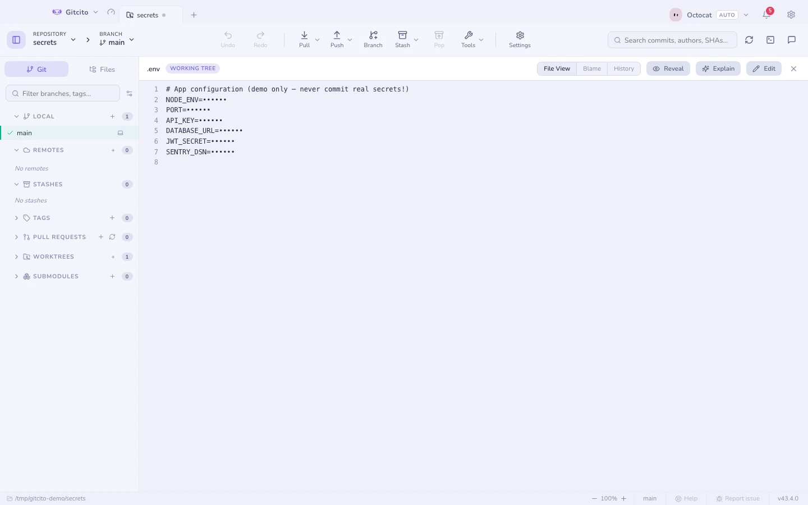

# Güvenlik ve sırlar

Gitcito'nun **arka ucu yoktur**. Tek ağ çağrıları Git sunucunuza ve, açarsanız,
yapay zekâ sağlayıcınıza gider.

## Sır maskeleme

`.env*`, `*.pem`, `*.key`, `id_rsa`, `credentials.*` ve benzerlerindeki
değerler diff, dosya ve blame görünümlerinde `KEY=••••••` olarak çizilir; böylece
bir ekran paylaşımı ya da ekran görüntüsü onları sızdıramaz.
Apple imzalama malzemesi de sayılır: `*.mobileprovision`,
`*.provisionprofile`, `*.p12` ve App Store Connect'in `*.p8` anahtarları. Bir
`*.cer` sayılmaz — sertifika tasarımı gereği geneldir.

Bu yalnızca **görüntüyle ilgilidir**: dosyayı asla değiştirmez, neyi
hazırladığınızı da asla değiştirmez. Bir göz düğmesi onları görünüm başına
açığa çıkarır. `.env.example`, `.sample` ve `.template` sır değil, şablon olarak
kabul edilir.

## Zarar vermeden önceki korumalar

| Koruma | Ne zaman |
|---|---|
| **Sır dosyası** | Kimlik bilgisine benzeyen bir şeyi commit'lerken — tek tıklamalık *Yoksay ve izlemeyi bırak* ile |
| **Büyük dosya** | Aşırı büyük bir blob'u commit'lerken (eşik: Ayarlar → Güvenlik) |
| **Derleme çöpü** | `xcuserdata/`, `DerivedData/` ya da bir `.DS_Store` işlemek — aynı tek tıklık *Yoksay ve izlemeyi bırak* ile |
| **Korumalı dal** | Doğrudan `main`/`master`'a commit'lerken ya da birini force push ederken |
| **İzlenen sırlar** | Bir sır dosyasını *izleyen* bir depoyu push ederken — oturum başına bir kez uyarılır |

## İşletim sistemi anahtar zinciri

Token'lar ve [kasa](vault.md) kayıtları, ayarlar dosyasındaki bir anahtarla
değil, işletim sisteminizin anahtar zinciriyle (Electron `safeStorage`)
şifrelenir.

**Siz söyleyene kadar anahtar zincirine hiçbir şey dokunmaz.** Sistemin kendi
izin penceresi belirmeden önce Gitcito neyin saklandığını, neyi
yapamayacağını (bir uygulama yalnızca kendi oluşturduğu kaydı geri okur —
diğer parolalarınıza erişilemez) ve hayır demenin sorun olmadığını anlatır:
o zaman token'lar yalnızca oturum boyunca bellekte yaşar, kasa kapalı kalır ve
istediğinizde **Ayarlar → Güvenlik → İşletim sistemi anahtar zinciri**
üzerinden açabilirsiniz.

Yeni bir kurulum, gerçekten saklanması gereken bir şey çıkana kadar **sıfır**
anahtar zinciri çağrısı yapar.

## Güvenle paylaşmak

[Güvenli paylaşım](secure-share.md) ayarları, kasa kayıtlarını veya bütün
çalışma alanlarını **şifreli bir paket** olarak dışa aktarır — sırlar yalnızca
siz kutuyu işaretlediğinizde dâhil edilir.

**Ayrıca bakınız:** [Kasa](vault.md) · [Güvenli paylaşım](secure-share.md)
