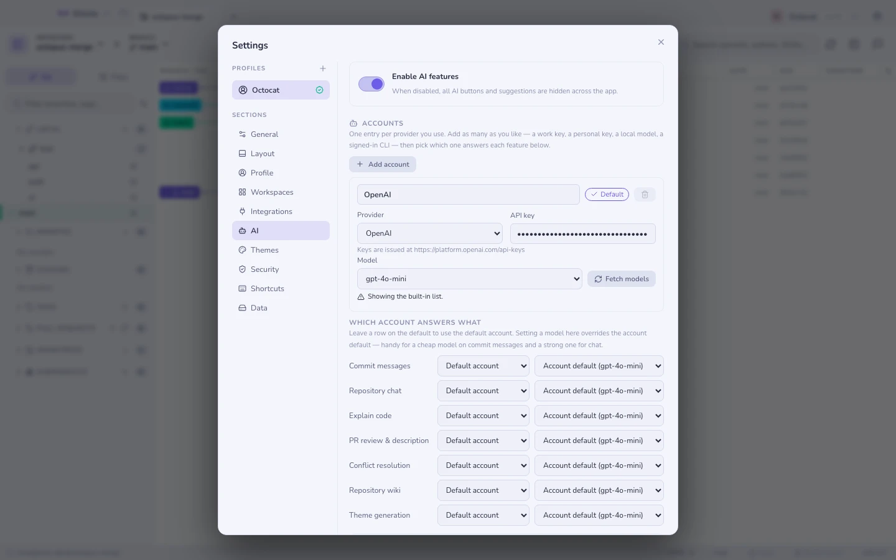
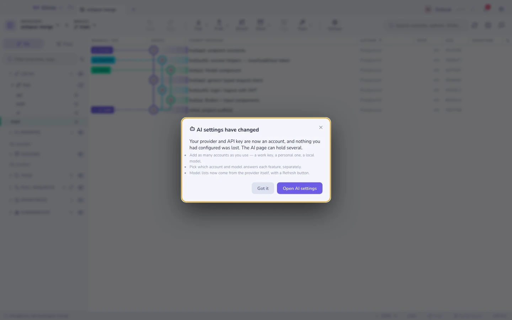

# Можливості ШІ

Кожна функція зі штучним інтелектом **необов’язкова** і вимкнена, доки ви не
налаштуєте провайдера. Нічого нікуди не надсилається, доки ви не попросите про
щось конкретне.

## Облікові записи

**Обліковий запис** — це один спосіб дістатися до моделі: провайдер, адреса, за
якою він доступний, і спосіб автентифікації. Їх можна налаштувати кілька, і вони
співіснують — робочий ключ, особистий, локальна модель, CLI, у яку ти вже
увійшов.

Пресети є для **OpenAI, Anthropic, Google Gemini, OpenRouter, Groq, Mistral** і
**Ollama** (цілком локально), а також для будь-якої точки входу, сумісної з
OpenAI.

Anthropic використовує власний API `/v1/messages`, а не виклик у формі OpenAI,
тож моделі Claude справді працюють, а не лише мають такий вигляд. До Gemini
звертаємося через OpenAI-сумісну точку входу Google.

### Підписка замість ключа API

Обери провайдера **Локальна CLI**, щоб відповідала вже встановлена й авторизована
на цій машині агентська CLI — `claude`, `gemini` або `codex`. Gitcito запускає
бінарник із твоїм запитом і читає відповідь; жодного ключа API вставляти не
треба, і жоден токен не зберігається.

Gitcito запускає лише ту команду, яку ти сам налаштував як обліковий запис, і
завжди зі списком аргументів, а не через оболонку, — тож ніщо з дифу чи назви
гілки не може бути витлумачене як команда.

> **Це не приватніше за ключ API.** Твої запити так само потрапляють до того
> самого постачальника, під твоїм власним записом, точно як із ключем. Змінюється
> оплата й налаштування, а не те, куди йде текст.

Якщо команди немає в `PATH`, укажи її повний шлях в обліковому записі.

### Який запис за що відповідає

У розділі **Який запис за що відповідає** кожна функція — описи комітів, чат,
пояснення коду, рецензія PR, розвʼязання конфліктів, вікі, теми — може вказувати
на власний запис і модель. Залиш рядок на значенні за замовчуванням, щоб він
ішов за основним записом. Дешева модель для описів комітів і потужна для чату —
звичний поділ.

### Повідомлення про оновлення

Під час оновлення з версії до облікових записів це показується один раз. Попередній провайдер і ключ стають першим записом; вручну налаштовувати нічого не треба.

## Моделі

Списки моделей надходять від самого провайдера й кешуються на добу; **Отримати
моделі** оновлює один список одразу. Під списком Gitcito каже, звідки він узявся
— наживо, з кешу (з датою) чи з вбудованого запасного, і чому.

Список відфільтровано до моделей, здатних відповісти на запит чату, тож
ембединги, мовлення та зображення до нього не потрапляють. Будь-яке поле моделі
приймає й довільний текст, тож модель у передперегляді, приватне розгортання чи
щойно завантажений тег Ollama завжди можна використати, навіть якщо провайдер їх
не перелічує.

Провайдер, якому ти ще не дав ключа, або недоступний, відкочується до невеликого
вбудованого списку, а не до порожнього випадного меню.

Жоден провайдер не публікує впорядкованого чи дібраного списку, тож порядок задає Gitcito: датовані знімки згортаються в модель, знімком якої вони є (`gpt-4o` покриває `gpt-4o-2024-08-06`), а решта йде від новіших до старіших, а не за абеткою. **Показати всі моделі** внизу списку повертає все, що надіслав провайдер.

## Що воно вміє

| Функція | Що ви отримуєте |
|---|---|
| **Повідомлення коміту** | Заголовок (і за бажанням тіло) із вашого проіндексованого діфа, у вибраному вами стилі |
| **Пояснити цей файл** | Пояснення людською мовою в бічній панелі — Звичайне, Стисле, ELI5… аж до Піратського |
| **Пояснення під курсором** | Затисніть <kbd>⇧</kbd> і наведіть на ідентифікатор, щоб отримати однорядкове пояснення разом із рядками, на яких воно ґрунтується |
| **Розв’язання конфліктів** | Пропонує злиття у редагований результат — ніколи не застосовує його автоматично |
| **Рев’ю PR** | Підсумовує діф і позначає ризики, кожен прив’язаний до справжнього `path:line` |
| **Опис PR** · **назви гілок** | Складаються з комітів і діфа гілки |
| **Теми** · **палітри графа** | Генеруються з промпту |
| **Розумна індексація** | Підказки про те, що належить саме до цього коміту |

## Прив’язано до коду, а не вгадано

Рев’ю бачить діф як **позначені ханки** і має право посилатися лише на ці
позначки; далі Gitcito сам розв’язує кожну позначку в справжній файл і рядок.
Модель, яка вигадала розташування, отримує **відмову і питання знову**, тож
знахідки завжди вказують на код, що існує.

Пояснення під курсором читає лише пронумероване вікно навколо токена — у діфі
лише ті ханки, що видно на екрані, — тож коли визначення живе деінде, воно так і
каже замість того, щоб вигадувати. Відповіді кешуються для кожної версії файлу.

**Замасковані файли з секретами ніколи не надсилаються.** Як і будь-які файли,
що підпадають під правила маскування секретів.

## Обмеження

- Вбудовані запасні списки старіють між випусками. Саме для цього є завантаження
  наживо; запасний список покриває лише випадок, коли завантажити не вдається.
- Добір моделей, придатних для чату, іде за назвою, тож чат-модель із незвичною
  назвою може випасти. Тоді впиши її вручну.
- Обліковий запис CLI не повідомить витрату токенів, якщо цього не робить сама
  CLI, — цифри використання й вартості в налаштуваннях недорахують такі виклики.
- Відповіді через CLI повільніші за прямий виклик API: бінарник піднімає цілу
  сесію на кожен запит.
- Ключі зберігаються окремо для кожного запису у сховищі ключів системи.
  Видалення запису видаляє і його ключ.

**Дивіться також:** [Вікі репозиторію](repo-wiki.md) · [Безпека та секрети](security.md)
