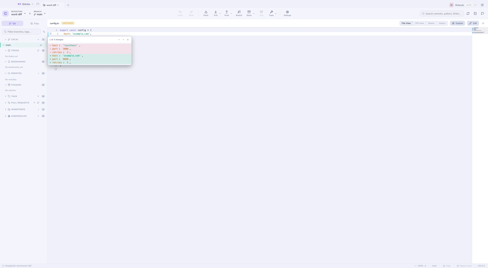

# Діфи та попередній перегляд

## Як читати діф

| Перемикач | Що робить |
|---|---|
| **Єдиний ↔ роздільний** | Пліч-о-пліч, коли ви хочете порівнювати, один під одним — коли хочете читати |
| **На рівні слів** | Підсвічує лише змінені токени всередині відредагованого рядка — червоним у старому, зеленим у новому |
| **Ігнорувати пробіли** | Ховає зміну відступів, щоб на поверхню вийшла справжня зміна |
| **Перенос** (лише у двох колонках) | Переносить довгі рядки в межах колонки замість прокручування |
| **Пов’язано** (дві колонки, без переносу) | Прокручує обидві половини разом, по вертикалі й по горизонталі — вимкнено, кожна колонка окремо |
| <kbd>⌘F</kbd> | Пошук усередині діфа, з переходом до наступного/попереднього |

Перенос типово вимкнено: один рядок займає один ряд, тож обидві сторони
лишаються порівнянними рядок до рядка, а кожна половина прокручується по
горизонталі власною смугою. Вмикайте його, коли довгий рядок хочеться
прочитати, а не наздоганяти, — платою буде те, що рядок, згорнутий у три ряди,
більше не стоїть навпроти своєї пари. Кожен перемикач запам'ятовує стан між
файлами та сеансами.

Без переносу обидві половини типово прокручуються **пов’язано** — по
вертикалі, що тримає рядки навпроти одне одного, і по горизонталі, тож 90-та
колонка ліворуч стоїть над 90-ю праворуч. Розв’яжіть їх, коли сторони
розійшлися — блок із відступом проти блока без нього, перейменування, що
зсунуло кожен рядок, — або коли хочете порівняти дві віддалені ділянки одного
файлу, і лишіть кожну половину там, де її вміст.

Над кожним діфом сидить [семантичне зведення](semantic-diff.md) — що змінилося,
символ за символом, а не рядок за рядком.

## Діфи зображень

Змінені зображення отримують справжнє порівняння: пліч-о-пліч або з повзунком,
який можна перетягувати між «до» і «після».

## Смуга змін і мінікарта

**Вигляд «Файл»** для файлу робочого дерева — проіндексованого чи ні, відстежуваного чи цілком нового — несе кольорову смугу біля кожного рядка, зміненого від HEAD (або індексу — для проіндексованих файлів): зелений для вставки, синій для зміни, маленький червоний клин там, де рядки видалено без заміни. Натисніть смугу, щоб побачити цю зміну, не покидаючи файл — у спливному вікні показано видалені й додані рядки, з кнопками «вперед»/«назад» для проходу по всіх змінах файлу.

**Мінікарта**, вимкнена за замовчуванням, додає зменшений огляд усього файлу біля правого краю — натисніть або перетягніть її, щоб перейти до потрібного місця, як робила б смуга прокрутки, якби вона ще й показувала форму файлу. Обидва — локальні для машини налаштування в **Налаштування → Загальні → Перегляд файлу**.

Жодна з них не читає історію: перемкніться на Diff, Blame або старіший коміт — і смуга зникає, адже ці вигляди вже показують кожну зміну напряму.

## Попередній перегляд будь-чого

Режим **Перегляд** відтворює файл замість того, щоб показувати його джерело:
Markdown, Word (`.docx`), Excel (`.xlsx`), PDF, відео, аудіо, зображення — і
код із підсвіченим синтаксисом для всього іншого.

### Property list від Apple

`Info.plist` і `*.entitlements` — це XML, а XML ніхто читати не збирався.
Попередній перегляд натомість показує схему «ключ — значення», ту саму, що
показує власний редактор plist у Xcode: вкладеність збережено, тип кожного
значення поруч.

Два обмеження. **Двійковий** plist (`bplist00`) розпізнається й називається, але
не декодується — проженіть його через `plutil -convert xml1`, якщо хочете бачити
тут, хоча двійковий plist у репозиторії зазвичай артефакт збірки, якому там не
місце. А значення `<data>` показуються числом байтів, а не base64: блоб вам нічого
не скаже, а профіль підготовки, намальований у панелі, яку ви, можливо,
демонструєте, скаже всім іншим забагато.

### Проєкти Xcode

`project.pbxproj` — це один плоский словник об'єктів, що посилаються одне на
одного за ідентифікаторами, тож читання по порядку майже нічого не каже про
проєкт. Перегляд проходить цими посиланнями й відновлює три речі, по які ви
прийшли: **цілі** з їхніми фазами збірки, **дерево груп** так, як його малює
навігатор Xcode, і **налаштування збірки** за конфігураціями.

Це читалка, а не редактор — ніщо тут не пише в проєкт. Про те, що буває, коли дві
гілки правлять той самий файл, — у
[розв'язанні конфліктів](conflicts.md).

## Дуже великі файли

Попередній перегляд і перегляд файлу завантажують файл у память повністю, тому
обидва відмовляються відкривати файли понад ліміт розміру (32 МБ для
попереднього перегляду, 16 МБ для тексту) і натомість показують, наскільки
великий файл. **Усе одно завантажити** знімає ліміт для цього файлу — ніщо не
є недосяжним, великі завантаження просто потребують явної згоди. Файли й дифи
довші за кілька тисяч рядків усе ще рендеряться повністю, але рядки поза
видимою областю більше не компонуються й не малюються — гігантський диф
lockfile-а перестає коштувати памяті цілого ноутбука.

## Вкладка «Файли»

Вкладка **Файли** на лівій бічній панелі дозволяє блукати самим робочим
деревом, зі значками стану на теках (додано / змінено / видалено), які
підсумовують те, що лежить усередині.

**Дивіться також:** [Семантичний діф](semantic-diff.md) · [Індексування](staging.md)
