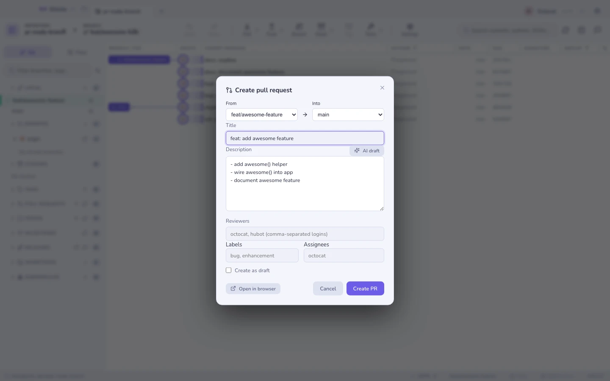

# Хостинг та pull-реквести

## Створення

Створіть pull- (або merge-) реквест, не покидаючи застосунку: випадні списки
гілок, заголовок і тіло, заздалегідь заповнені з комітів гілки, перемикач
чернетки і — на GitHub — рецензенти, мітки та виконавці, застосовані одразу під
час створення.

Працює на **GitHub, GitLab, Bitbucket і Azure DevOps**. Відкриті PR/MR для всіх
чотирьох показані на бічній панелі.

Почніть із порівняння гілок, із графа, з `+` у панелі PR або із задачі (яка
підставить `Closes #N`).

## Рев’ю — GitHub

| | |
|---|---|
| **Обговорення** | Коментарі та стан рев’ю |
| **Перевірки** | Прогони CI зі статусами пройдено/провалено/очікує та посиланнями на логи |
| **Переглянуті файли** | Чек-лист із ✓ на кожен файл і прогресом |
| **Гілки коментарів** | Коментарі до рядків, згруповані за `file:line` разом із їхнім ханком діфа, і відповіді |
| **Дії** | Коментувати, схвалити, запросити зміни та злити / squash / rebase |

Якщо хтось зробив примусовий пуш посеред рев’ю,
[що змінилося відтоді](range-diff.md) покаже вам, що саме зрушило.

## Задачі, віхи, релізи — GitHub

Переглядайте задачі й відкривайте повноцінну вкладку задачі: тіло, коментарі,
мітки, виконавці, віха, поля Projects v2, закриття/перевідкриття і **створення
гілки для цієї задачі** (з назвою від ШІ). Віхи показують прогрес і свої задачі.
Релізи можна переглядати разом зі сторінкою змін.

## Сповіщення — GitHub

Уся ваша вхідна скринька — запити на рев’ю, згадки, активність CI — по всіх
репозиторіях, із фільтрами непрочитаного/усього та позначенням як прочитане.
Дзвіночок на панелі носить бейдж непрочитаного, а за бажанням спрацьовують і
системні сповіщення, коли у вас просять рев’ю або коли завершується CI.

## Токени

Окремі токени для кожного профілю — для кількох облікових записів чи організацій
— зберігаються в keychain вашої ОС. Gitcito також уміє позичити те, що вже
тримає ваш **помічник облікових даних git**, тож організація, для якої ви вже
пройшли автентифікацію, часто взагалі не потребує налаштування. Дивіться
[Безпеку та секрети](security.md).

**Дивіться також:** [Стековані гілки](stacks.md) · [Можливості ШІ](ai.md)
