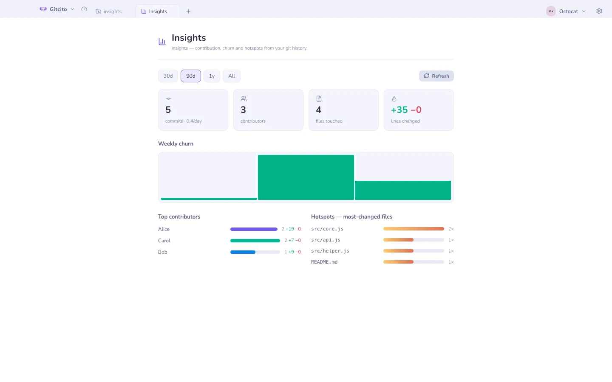

# Аналітика

Панель, побудована з вашої історії Git — жодного сервісу, жодного облікового
запису, лише `git log`, прочитаний локально. Відкрийте її з шестерні налаштувань
репозиторію поруч з інструментами панелі.

| Панель | Що вона показує |
|---|---|
| **Зведені картки** | Коміти за день, учасники, зачеплені файли, змінені рядки |
| **Тижнева плинність** | Додані рядки проти вилучених, тиждень за тижнем |
| **Найактивніші учасники** | За комітами і за рядками |
| **Гарячі точки файлів** | Найчастіше змінювані файли — клацніть, щоб перейти до історії файлу |

Відфільтруйте все це за **30 днями / 90 днями / 1 роком / усім часом**.

Гарячі точки — найцікавіша панель: файл, що тримається у верхівці цього списку
тиждень за тижнем, зазвичай говорить вам щось про архітектуру, а не про людей,
які його редагують.

Щоб побачити ту саму історію як рухому картинку, дивіться
[таймлапс](timelapse.md).

**Дивіться також:** [Таймлапс](timelapse.md) · [Blame та історія файлу](blame.md)
