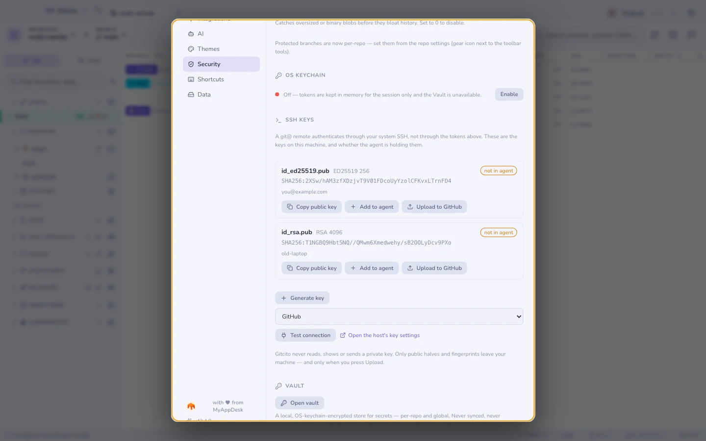

# Ключі SSH

**Налаштування → Безпека → Ключі SSH.**

## Чому це живе поруч із токенами

Gitcito автентифікує дві різні речі, і люди цілком закономірно вважають, що це
одна:

| | Чим автентифікується |
|---|---|
| **API хостингу** — репозиторії, PR, задачі, перевірки CI | Ваш [токен](hosting.md) |
| Транспорт git через `https://` | Ваш токен, вбудований в URL |
| Транспорт git через **`git@…`** | **Ваш ключ SSH, через системний ssh** |

Ремоут на кшталт `git@github.com:me/api.git` до токена не торкається взагалі.
Git передає з’єднання програмі `ssh`, яка про персональні токени доступу зроду
не чула. Це не якийсь крайній випадок — це те, що ви отримуєте, коли репозиторій
налаштовував колега, коли `.gitmodules` містить URL із `git@`, коли ваша компанія
вимикає автентифікацію по HTTPS або коли хостинг — це самостійно розгорнутий
GitLab.

Коли щось іде не так, ssh каже `Permission denied (publickey)` — і більше нічого.
Технічно правда, як порада — марно.

## Що вам показує цей розділ

Кожен знайдений у `~/.ssh` ключ показує свій тип, розмір, відбиток і коментар,
а ще один факт, який пояснює більшість раптових збоїв:

**in agent** / **not in agent.** Ключ, якого агент не тримає, не може
автентифікувати нічого, а агент забуває свій вміст після перезавантаження, якщо
операційній системі не сказали інакше. «Учора ж працювало» — зазвичай саме це.

## Що тут можна зробити

| Дія | Що виконує |
|--------|--------------|
| **Копіювати публічний ключ** | Кладе рядок `.pub` у буфер обміну, готовий до вставляння на будь-якому хостингу |
| **Додати до агента** | `ssh-add` (з `--apple-use-keychain` на macOS, щоб пережив перезавантаження) |
| **Вивантажити на GitHub** | `POST /user/keys` з токеном цього профілю |
| **Згенерувати ключ** | `ssh-keygen -t ed25519`, з коментарем із вашого git-email |
| **Перевірити з’єднання** | `ssh -T git@<host>`, перекладене на людське речення |

**Перевірити з’єднання** існує тому, що власна відповідь ssh вводить в оману:
GitHub успішно вас автентифікує, а *потім* виходить із кодом помилки, бо не дає
шелу. Gitcito читає повідомлення, а не код виходу, і показує сирий вивід нижче,
щоб ви могли перевірити його прочитання.

## Обмеження, сказані прямо

- **Вивантаження працює лише для GitHub.** GitLab, Bitbucket і Azure DevOps
  отримують *Копіювати публічний ключ* і посилання прямо на їхню сторінку
  налаштувань ключів. Реєстрація ключів на решті трьох не реалізована, і кнопка
  не вдає протилежного.
- **Генерація ніколи не перезаписує.** Ім’я, яке вже є в `~/.ssh`, буде
  відхилено. Мовчазний перезапис приватного ключа відбирає у вас доступ до всього,
  що йому довіряє, і жоден діалог підтвердження цього не поверне.
- **Gitcito не зберігає парольні фрази.** Ви вводите її під час генерації або
  додавання до агента; вона передається в `ssh-keygen`/`ssh-add` і забувається.
  Зберігати її між перезавантаженнями — робота системного сховища ключів, через
  `ssh-add`.
- **Жодного редагування `~/.ssh/config`**, жодних аліасів хостів, жодного вибору
  ключа для окремого репозиторію. Це живе у вашій конфігурації ssh, і Gitcito той
  файл не чіпає.

## Що ніколи не залишає вашу машину

**Gitcito ніколи не читає, не показує і не передає приватний ключ.** Розділ
перелічує публічні половини й відбитки. Єдине, що взагалі кудись надсилається, —
це публічний ключ, для якого ви свідомо натиснули **Вивантажити**; і йде він на
GitHub, під вашим власним токеном, після підтвердження, у якому названо відбиток.

Дивіться також: [Безпека та секрети](security.md) · [Хостинг і пул-реквести](hosting.md)
