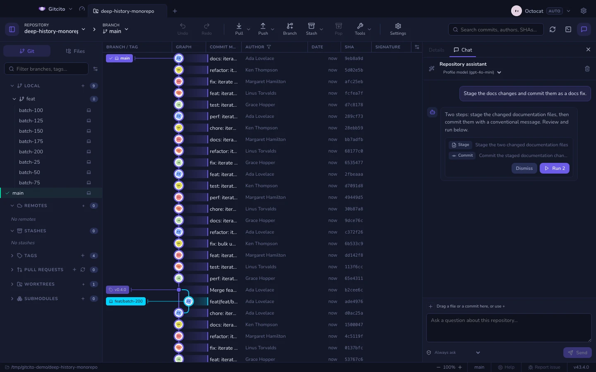

# 仓库聊天

有些问题，问一句比翻半天更快。*令牌刷新到底发生在哪里？这个提交一句话说改了什么？
这个文件为什么存在？* 仓库聊天基于当前打开的仓库作答，并给出它所依据的代码行。

它与**详情**共用右侧栏：顶部的标签在两者之间切换，所以提问时提交图不会丢掉选中项。

## 它读什么

每个回答分两轮生成。第一轮从仓库自己的已跟踪文件清单里挑出少量路径和字面搜索词。
第二轮只用这些片段作答，并且只能引用这些片段：凭空捏造的文件或行号是校验错误，
而不是听起来合理的答案。

| 包含 | 不包含 |
|---|---|
| 已跟踪文件，按工作区中的样子 | 未跟踪文件 |
| 已跟踪文件的暂存与未暂存差异 | 命中忽略规则的一切，即便仍被跟踪 |
| 分支、领先/落后、以及变更路径清单 | [疑似机密的文件](security.md)、二进制文件、生成路径 |

读取工作区意味着你可以讨论尚未提交的修改；同时也意味着提问时这些修改会离开本机，
接收方是你在 [AI 功能](ai.md)中配置的提供方。

有一处细节：启用操作提议（见下文“从聊天中运行操作”）后，未跟踪文件的**文件名**
会包含在仓库状态里——“暂存那个新文件”需要它们——但其内容依旧永不读取。

## 固定上下文

读什么由模型决定。固定就是推翻这个决定的办法：被固定的内容**优先**读取，并占据
上下文预算中更大的一份。

四种固定方式，都会进入输入框上方的同一排标签：

| 这样做 | 得到 |
|---|---|
| 点击建议标签 | 查看器中打开的文件，或提交图中选中的提交 |
| 从**文件**标签页拖一行过来 | 该文件 |
| 从**提交图**拖一行过来 | 该提交——提交信息，以及按块拆分的差异 |
| **+** →“选择文件…”，或从访达/资源管理器拖入 | 磁盘上的任意文件，包括仓库之外的 |

标签会为后续提问保持固定；`×` 移除单个，清空对话则全部移除。上限为八个。

被固定的提交会贡献提交信息和至多十二个差异块。触及被排除路径的块会从该差异中剔除，
而不是丢掉整个提交。

## 设置

**设置 → AI → 仓库聊天**：

| 设置 | 作用 |
|---|---|
| **就仓库提问** | 关闭后标签页、工具栏按钮与快捷键目标都会消失，其余 AI 功能照常 |
| **聊天模型** | 只用于聊天的模型。留空则沿用配置档的模型——提问比审查便宜，较小的模型通常够用 |
| **仅已提交的内容** | 基于最后一次提交而非工作区作答，未提交的修改绝不离开本机 |
| **在聊天中提议 Git 操作** | 关闭后聊天回到纯只读：没有操作卡片，也没有批准下拉菜单 |
| **提议的操作如何运行** | 批准模式——见下文“批准模式”。破坏性操作无论选哪种都会先确认 |

如果整个 AI 都关闭，聊天也随之消失：不会留下一个无人能应答却仍在邀请提问的面板。

聊天模型也可以在面板顶部提供方名称旁边直接切换——同一个设置，不必打开设置页。

## 处理消息

消息就是普通文本。选中任意部分即可复制,也可以右键点击气泡:**复制**复制选中
内容,**复制消息**复制整条消息(回答会以其 Markdown 源文本复制),如果点击落在
链接上,**复制链接**复制其地址。

链接始终在默认浏览器中打开,绝不会在 Gitcito 内部打开——回答中的 Markdown
链接和你消息里的 `https://` 地址都一样。

当消息提到图片时——比如 `docs/logo.png` 这样的仓库路径,或以图片扩展名结尾的
URL——把鼠标悬停在该处会显示一个小预览。仓库路径从工作树读取;无法解析为可读
图片的提及不会显示任何内容。

## 从聊天中运行操作

不问事实、改提要求——*暂存那些 Markdown 文件，把这个作为修复提交，把构建产物
加进忽略列表*——回复就会附带一张**操作卡片**：助手想执行的具体步骤，一行一个
操作，配有**运行**与**忽略**按钮。卡片里的一切都尚未发生；模型只能提议，而且
每个提议在你看到之前都会先对照工作区检查——提到不存在的文件的操作会被直接拒绝，
根本不会显示。

仓库聊天可以提议精确编辑、创建或完整替换文件以及删除文件，然后继续执行**运行**
助手已有的 Git 操作。可展开的 diff 由 Gitcito 在本地计算。现有文件必须来自助手读过
的证据；不安全、含机密、被忽略、生成、二进制、已过期、过大或经符号链接访问的目标
都会被拒绝。推送、拉取、重置、变基和强制操作仍只能在专用界面中执行。

整批文件会在第一次写入前重新验证；任一步失败都会回滚。提交前，Gitcito 还会确认有
已暂存的更改。卡片会标记每项已完成、失败或跳过的操作并保留部分结果。随后，另一次
禁止操作的模型调用只负责总结实际结果。

### 批准模式

输入框下方的盾牌下拉菜单（也在**设置 → AI → 仓库聊天**中）决定卡片如何运行：

| 模式 | 运行方式 |
|---|---|
| **每次都询问** | 在你按下卡片上的**运行**之前什么都不做 |
| **自动运行安全操作** | 只由可逆的日常整理组成的提议——暂存、取消暂存、忽略、建分支、打标签——到达即运行；其余仍等按钮 |
| **自动运行所有操作** | 每个提议到达即运行，破坏性操作除外 |

会**放弃未提交修改**的提议在任何模式下都会先询问，且确认框会列出将丢失的文件。
卡片会汇报实际发生了什么——运行了多少项操作，或是让它们停下的错误——助手也会
得知结果，因此后续提问知道它的计划究竟是执行了还是被忽略了。

### 让助手修复错误

当某个 Git 操作失败且 AI 聊天可用时，错误提示上会多出一个星光按钮：点击它会打开
聊天，并把失败信息粘贴进输入框，于是“为什么失败、我该怎么办”只需一次点击。草稿
可以编辑——在你按下发送之前什么都不会发出。

## 它拒绝什么

- **疑似机密的文件永不读取**，固定与否都一样：对应标签会带着原因作为“已跳过”返回。
  固定不是绕开[机密遮蔽](security.md)的办法。
- **二进制文件与超过 512 KB 的文件**来自仓库之外时同样被跳过。仓库之内则适用常规规则。
- **它从不自行写入。**模型没有工具，只有文本：改动以提议卡片的形式出现，只在你的
  批准规则（见上文“批准模式”）之下运行，破坏性步骤总会先确认。关闭**在聊天中提议
  Git 操作**后，它连提议都不会给出。
- **对话只存在于内存中。**每个仓库各有独立会话；退出 Gitcito 即丢弃。

## 如何打开

| 按键 | 作用 |
|---|---|
| 工具栏上的对话气泡按钮 | 切换“聊天”标签 |
| <kbd>⌘⌥B</kbd> / <kbd>Ctrl+Alt+B</kbd> | 切换整个右侧面板 |
| <kbd>⌘⏎</kbd> / <kbd>Ctrl+Enter</kbd> | 发送消息 |

其余内容（包括如何重新绑定面板开关）见[键盘与快捷键](keyboard.md)。

**另见：** [AI 功能](ai.md) · [安全与机密](security.md) · [仓库百科](repo-wiki.md)
