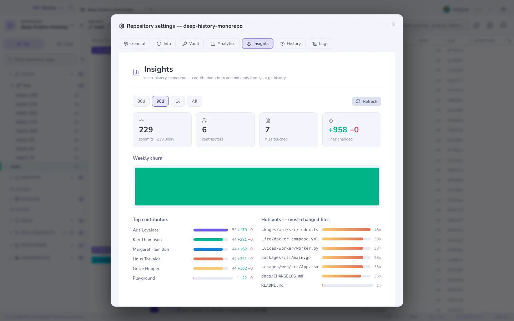

# 按仓库的设置

工具栏工具旁边那个齿轮，打开的是属于**这个**仓库的设置，而不是应用的设置。

| 标签页 | 里面有什么 |
|---|---|
| **通用** | 受保护分支（一个分支多选框，存在 git config 里）、签名 |
| **Config** | 这个仓库在 `.gitcito.json` 里[携带的规则](repo-config.md)，以及检查它们的 doctor |
| **信息** | 关于这个仓库的自由格式笔记与字段，只保存在本地 |
| **保险库** | 这个仓库的[保险库](vault.md)条目 |
| **洞察** | [历史仪表盘](insights.md) |
| **统计** | 你在这个仓库里做过什么，在本地计数 |
| **历史** · **日志** | 操作日志：Gitcito 运行过的每一条 git 命令，连同它的输出 |

操作日志是诚实的那一个：当某件事表现得古怪时，它会给出确切的命令和确切的错误，这样一份缺陷报告就能带上事实，而不是形容词。

**另请参阅：** [安全与机密](security.md) · [洞察](insights.md)
