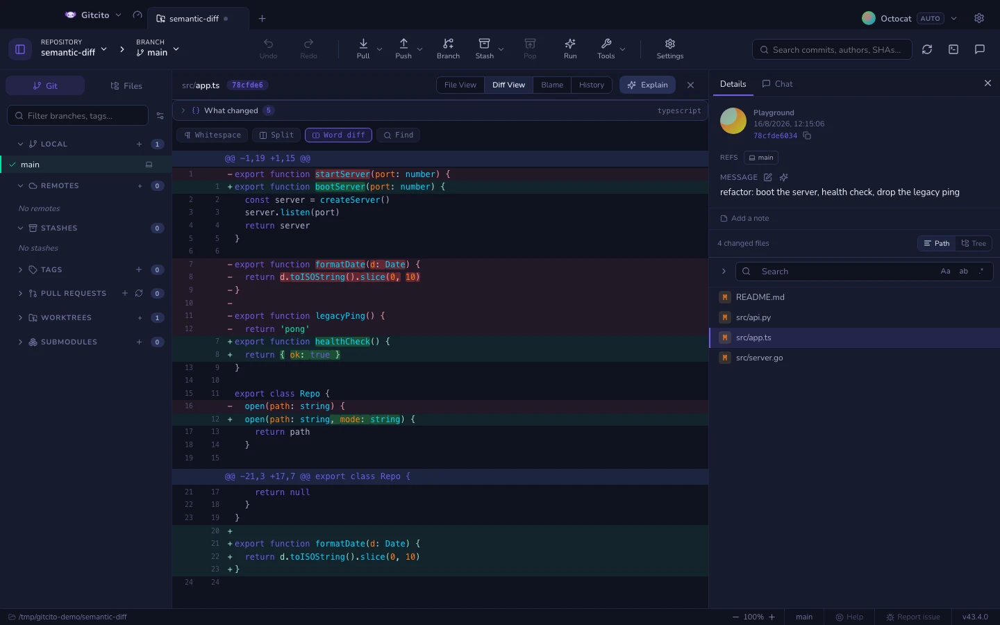

# 语义差异

一次纯粹的重命名，在行级差异（diff）里表现为整个文件被删掉、又整个文件被加回来。这在技术上完全正确，也完全没用。

在每个文件差异的上方，Gitcito 会显示一条**改了什么**的条带：文件的两个版本都用 **tree-sitter** 解析——真正的语法树，不是正则表达式——然后把两边的声明配对起来。

| 判定 | 例子 |
|---|---|
| **已重命名** | `startServer` → `bootServer` |
| **签名变化** | `open(path)` → `open(path, mode)` |
| **新增** ／ **移除** | 一个新函数；一个被删掉的函数 |
| **已移动** | 同样的代码，往下挪了 40 行 |
| **已修改** | 同名同签名，函数体不同 |

重命名和签名变化排在最前面——它们正是审阅者绝不能漏掉的东西。点击某一行即可跳到差异中的那个符号。

## 它能解析什么

TypeScript、TSX、JavaScript、Python、Go、Rust、Java、C、C++、C#、Ruby、PHP、Swift、Kotlin、Scala、Lua、Bash 和 Zig。

如果某个文件的语言没有对应的语法，它就照常保留普通的行级差异——那条条带干脆不会出现。超过 400 KB 的文件也是如此。

## 诚实的局限

- 如果一次重命名的函数体也变了，它会报告为重命名**并且**明说这一点。
- 两个碰巧长得像的单行函数*不会*被配对：在某个体量阈值以下，匹配必须近乎完全一致，所以你得到的是干净的「移除 + 新增」，而不是一次虚构的重命名。
- 仅仅因为上方有东西变长而漂移了几行的符号，不会被报告为「已移动」——那样只会把真正的移动淹没掉。

**另请参阅：** [差异查看器](diffs.md) · [自那以后改了什么](range-diff.md)
